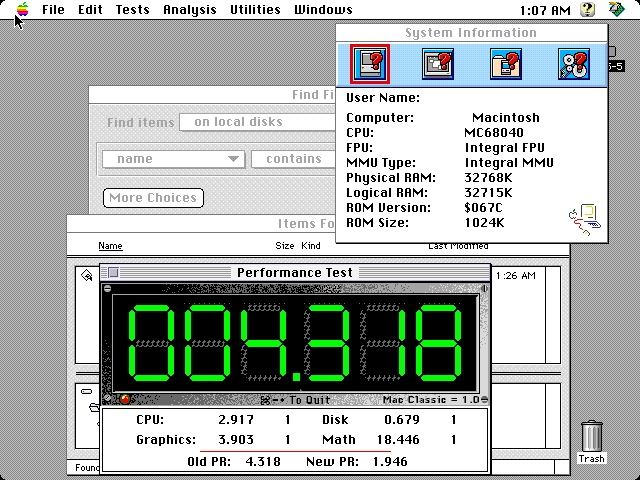
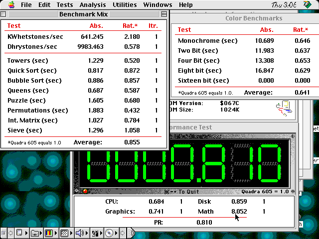

# Performance measurements — Speedometer 4.02

> **2026-09-01 follow-up:** a timing-clean related-clock SDRAM handoff now
> measures 151 ns per isolated read and 22.0 MB/s sequentially in
> `tb_sdram`. On hardware, Speedometer **3.23 PR Tests** improved from CPU
> 2.661 on the seed-13 control to **2.917** on seed 15 (+9.6%). Version 3.23's
> PR score is not the same metric as the 4.02 Benchmark Mix below; see §8.
> A 2026-09-02 BL8/open-page follow-up raises that same 3.23 CPU score to
> **3.139** and passes the full suite; see §9.

Three-way comparison of a **real Quadra 800**, the **Wombat33 core before the
SDRAM fast path**, and the **core with it**. Measured 2026-09-01 on hardware
(DE10-Nano + MiSTer SDRAM board), same disk image, same ROM, same Mac OS.

| | Benchmark Mix | Color QuickDraw |
|---|---|---|
| Real Quadra 800 | **1.897** | **1.283** |
| Wombat33 `20260831_2` (before) | 0.200 | 0.198 |
| Wombat33 seed 13 (after) | **0.231** | **0.219** |
| **Gain from the SDRAM work** | **+15.5 %** | **+10.6 %** |
| **Still short of real hardware by** | **8.2×** | **5.9×** |

Speedometer's ratios are against a **Quadra 605 = 1.0** (FPU against a Quadra
650). Higher is better. For the `(sec)` rows a *lower* absolute is better; for
the `/sec` rows a *higher* absolute is better.

The headline: the memory work is worth a solid, reproducible **15 %** of real
CPU throughput — and the emulated Quadra is still **roughly eight times slower
than the machine it is emulating**.

---

## 1. What was compared

| | Real Quadra 800 | Before | After |
|---|---|---|---|
| Bitstream | — | `releases/wombat33_20260831_2.rbf` | seed 13 of `cpu-speed-sdram` |
| md5 | — | `4414e7b3294b3d554a9e43faa16682bd` | `abb5ede4f776d20ccd74367813aa1d28` |
| Provenance | photograph | commit `cc53fbd` | branch `cpu-speed-sdram`, `3d1f28c` |
| Timing (STA) | — | met, +0.062 ns | **met, +0.132 ns** |
| CPU | MC68040 | MC68040 | MC68040 |
| FPU / MMU | Integral / Integral | Integral / Integral | Integral / Integral |
| ROM | `$067C`, 1024K | `$067C`, 1024K | `$067C`, 1024K |
| Physical RAM | 122880K | 32768K | 32768K |
| Bus clock | 33.33 MHz | 33.000 MHz | 33.000 MHz |

Both Wombat33 md5s were verified **on the MiSTer after the push**, not just
locally. The guest was shut down from the Apple menu before every core swap.

Seed 13 is the fit that **meets timing** — `scripts/deploy_screenshot.sh`
passed it with "Timing OK — worst slack +0.132 ns" and no override, the only
build in this campaign that did. Seed 8 (−0.501 ns) was measured first and
produced numbers identical to seed 13 within noise, which is the expected
result: a fitter seed changes placement, not throughput. See
`wombat33.qsf` for the full seed walk.

Two differences from the real machine worth keeping in mind: it has 128 MB
against our 32 MB (irrelevant to these tests, which are cache- and
bandwidth-bound rather than capacity-bound), and its bus is 1 % faster.

## 2. Benchmark Mix

Absolute values. One iteration of every test, which is what the reference
photograph used.

| Test | Real Q800 | Before | After | After vs before | After vs real |
|---|---|---|---|---|---|
| KWhetstones/sec | 1978.474 | 157.809 | 190.895 | **+21.0 %** | 10.4× slower |
| Dhrystones/sec | 24999.350 | 2033.948 | 2378.625 | **+17.0 %** | 10.5× slower |
| Towers (sec) | 0.469 | 5.048 | 4.250 | **−15.8 %** | 9.1× |
| Quick Sort (sec) | 0.532 | 3.396 | 3.016 | −11.2 % | 5.7× |
| Bubble Sort (sec) | 0.566 | 3.885 | 3.569 | −8.1 % | 6.3× |
| Queens (sec) | 0.307 | 3.047 | 2.622 | −14.0 % | 8.5× |
| Puzzle (sec) | 0.799 | 5.739 | 5.366 | −6.5 % | 6.7× |
| Permutations (sec) | 0.619 | 8.575 | 7.051 | **−17.8 %** | 11.4× |
| Int. Matrix (sec) | 0.599 | 4.766 | 4.335 | −9.0 % | 7.2× |
| Sieve (sec) | 0.974 | 5.821 | 5.187 | −10.9 % | 5.3× |
| **Average ratio** | **1.897** | **0.200** | **0.231** | **+15.5 %** | **8.2×** |

The spread across tests is itself informative. Permutations (+17.8 %) and
Towers (+15.8 %) gain most — both are pointer-chasing, cache-missing workloads
that spend their time waiting on memory. Puzzle (+6.5 %) and Bubble Sort
(+8.1 %) gain least, being tight loops that mostly stay in the '040's caches
and were never waiting on SDRAM. That is exactly the signature the change
should produce, and it is a useful sanity check that the gain is real rather
than measurement drift.

## 3. Color QuickDraw

All four depths from 1-bit to 8-bit; 16 bits/pixel is greyed out in Speedometer
on this hardware and was not run on the real machine either.

| Test | Real Q800 | Before | After | After vs before | After vs real |
|---|---|---|---|---|---|
| Monochrome (sec) | 5.356 | 36.804 | 32.936 | −10.5 % | 6.1× |
| Two Bit (sec) | 5.961 | 40.341 | 36.285 | −10.1 % | 6.1× |
| Four Bit (sec) | 6.806 | 43.115 | 39.054 | −9.4 % | 5.7× |
| Eight bit (sec) | 8.242 | 49.479 | 45.212 | −8.6 % | 5.5× |
| **Average ratio** | **1.283** | **0.198** | **0.219** | **+10.6 %** | **5.9×** |

Colour gains less than the CPU mix (~10 % against ~15 %), which fits: QuickDraw
here is drawing into **VRAM, which is on-chip BRAM**, not SDRAM. Only the
source data and the drawing code itself come through the memory path this
branch touched, so only part of the work could speed up.

## 4. FPU

Not run on the previous release (agreed to skip). Seed 8 only, for the record,
against a Quadra 650 = 1.0:

| Test | Abs. | Rat. |
|---|---|---|
| KWhetstones/sec | 827.979 | 0.159 |
| Matrix Mult. (sec) | 4.572 | 0.154 |
| Fast Fourier (sec) | 1.679 | 0.171 |
| **Average** | | **0.161** |

## 5. How much to trust these numbers

**Benchmark Mix reproduces to under 1 %, across two different bitstreams.**
Four independent runs — three on seed 8 (the last after a flash to the
previous release and back) and one on seed 13:

| Test | s8 run 1 | s8 run 2 | s8 run 3 | seed 13 |
|---|---|---|---|---|
| KWhetstones/sec | 190.959 | 191.395 | 191.015 | 190.895 |
| Dhrystones/sec | 2378.068 | 2379.446 | 2378.287 | 2378.625 |
| Towers | 4.250 | 4.249 | 4.250 | 4.250 |
| Permutations | 7.050 | 7.048 | 7.051 | 7.051 |
| Sieve | 5.186 | 5.169 | 5.187 | 5.187 |
| **Average** | **0.231** | **0.231** | **0.231** | **0.231** |

The previous release was likewise run twice (average 0.200 both times, every
test within 2 %). A 0.200 → 0.231 difference is an order of magnitude larger
than that noise. That seed 8 and seed 13 agree to three decimals is also the
expected control: a fitter seed changes placement and timing closure, not what
the machine computes per second.

**The 8-bit colour test has one bad sample, now identified.** Four
measurements of it on this RTL: 43.713, **32.440**, 45.184 and 45.212 seconds.
Three cluster tightly around 45 s; the 32.440 s reading is a lone outlier. An
earlier sweep that caught it suggested a 22 % colour gain — that number is
wrong, and it is recorded here only so nobody rediscovers it and believes it.
The table in §3 uses the reproducible value. Monochrome, 2-bit and 4-bit
repeat to within 0.5 % across every run. **What produced the single fast
sample is still unexplained and worth a look.**

**A screensaver is armed on this disk** and its idle timeout sits somewhere
between 250 s and 400 s. One early run ended with it up; that run was repeated
inside a shorter window and agreed to three decimals, so it did no harm, but
any future timing work on this machine should keep runs inside ~250 s of the
last input or disable it first.

## 6. Method

Speedometer 4.02, from `Quad Squad:Utilities:`. Driven over the MiSTer remote
websocket (`scripts/mister_ws.py`); helper scripts in `scratch/perf/`.

- The guest's **Command key is PS/2 Left Alt** (`rtl/adb.sv:530` maps it to ADB
  `$37`), i.e. Linux keycode 56, so ⌘B is `down:56 raw:48 up:56`. Speedometer's
  shortcuts — ⌘B Benchmark Mix, ⌘G Color QuickDraw, ⌘F FPU — make the whole
  run keyboard-driven; only the checkboxes need the mouse.
- Navigation to the app used the Finder's **type-select + ⌘O**, which is far
  more reliable than clicking icons.
- **No screenshots were taken during a run.** The capture is an HTTP POST the
  core services, and it perturbs what is being timed.
- Mouse positioning is a closed loop, because mrext sends *relative* motion and
  Mac OS accelerates it — the event-to-pixel scale measured anywhere from 1.3
  to well over 8 px per event depending on how many events got coalesced into
  one ADB report. `scratch/perf/click.sh` pins the pointer into the top-left
  corner (the one position the screen edge makes certain) and then walks to the
  target, re-measuring the scale from a screenshot after every move.
- A dialog screenshotted immediately after it opens can be caught mid-redraw,
  missing its title, static text and button labels. That is not a rendering
  fault; give it a few seconds before grabbing. (It briefly looked like a
  regression from this branch until the same dialog was re-grabbed with a
  settle delay and drew perfectly.)

### Screenshots

Before — `releases/wombat33_20260831_2.rbf`:

After — seed 13 of `cpu-speed-sdram`, the fit that meets timing:

The seed-8 capture (`perf/wombat33_seed8_sdram-fastpath.png`) is kept as the
independent second sample.

## 7. What this says about the SDRAM work

`docs/sdram-fast-path.md` measured the memory path in isolation with
`verilator/tb_sdram.sv`: an isolated store fell from 242 ns to 30 ns and a read
beat from 272 ns to 212 ns. This document is the end-to-end consequence of
that: **+15.5 % on the CPU mix, +10.6 % on colour**, on real silicon running
real Mac OS, in a build that meets timing.

That ratio is worth understanding rather than being disappointed by. An 8×
store latency win does not become an 8× machine win because most instructions
are not stores and most stores were already overlapping with something. The
tests that gained most are the ones that miss cache most, which is the
signature of a genuine memory-path improvement.

**The gap that remains is the interesting part.** At 8.2× slower than a real
Quadra 800 on the CPU mix, the bottleneck is no longer only the platform's
memory path:

- A read beat is now 212 ns of which the SDRAM row cycle is ~81 ns; the rest is
  the two clock-domain crossings. Removing them (§1c of the speed plan) is the
  next platform item and is worth more than its position in the running order
  suggested.
- Page mode (§1d) is the structural prerequisite for real-Quadra bandwidth;
  the follow-up prototype shows it must be paired with a full-line path.
- Beyond that the remaining terms are inside the CPU core — the write-through
  cache with no write buffer, and the lack of an early ack on line fills — which
  live in the `rtl/ap68040` submodule.

A useful next measurement would be the same three-way comparison after the
page-mode work (§1d) lands, to see how much of the 8.2× is memory and how much
is the core.

## 9. Alan's AP68040 `5aa596f` on the block-cache core (2026-09-07)

Build `scratch/MacQuadra800_cpu_nocd_ecd5705e.rbf` (md5 `ecd5705e…`): `main`
`17767e8` -- the SCSI block cache release source plus the `rtl/ap68040`
submodule at Alan Steremberg's `5aa596f` (retained instruction fetches across
branches, memory operands retired on read acknowledge, DBcc collapse, simple
An effective addresses and source-EA dispatch bypassed, register ADD operands
preselected in decode) -- with `CDROM_OFF=1`, because that core is +20 %
logic cells and no longer fits next to the CD-ROM target (4221 LABs of 4191
even with aggressive-area synthesis). 93 % ALMs, timing met at +0.494 ns.
Same disk (Quad Squad), Speedometer 4.02, one iteration, driven by the
operator subagent; screenshots in `scratch/perf_ecd5705e/`.

Boot to the Finder desktop: 136 s (150 s on the 03f83c62 cache release the
same evening), 78.65 MB read.

### Benchmark Mix (Quadra 605 = 1.0), three clean runs

| Test | Run 1 | Run 2 | Run 3 | 2026-09-01 (§2 "After") | vs 09-01 |
|---|---|---|---|---|---|
| KWhetstones/sec | 325.239 | 326.340 | 326.166 | 190.895 | 1.71× |
| Dhrystones/sec | 4173.212 | 4173.257 | 4172.981 | 2378.625 | 1.75× |
| Towers (sec) | 2.387 | 2.387 | 2.386 | 4.250 | 1.78× |
| Quick Sort (sec) | 1.961 | 1.959 | 1.959 | 3.016 | 1.54× |
| Bubble Sort (sec) | 2.648 | 2.648 | 2.648 | 3.569 | 1.35× |
| Queens (sec) | 1.534 | 1.533 | 1.534 | 2.622 | 1.71× |
| Puzzle (sec) | 4.144 | 4.121 | 4.127 | 5.366 | 1.30× |
| Permutations (sec) | 3.574 | 3.574 | 3.574 | 7.051 | 1.97× |
| Int. Matrix (sec) | 2.823 | 2.812 | 2.808 | 4.335 | 1.54× |
| Sieve (sec) | **0.494** (bogus, see below) | 4.592 | 4.593 | 5.187 | 1.13× |
| **Average ratio** | (0.608) | **0.361** | **0.361** | 0.231 | **+56 %** |

Runs 2 and 3 agree to 0.3 % on every line. Color QuickDraw (⌘G, four depths):
mono 21.989 s, 2-bit 24.806, 4-bit 27.610, 8-bit 32.540, **average 0.317**
(0.219 on 09-01, +45 %). FPU (⌘F, Quadra 650 = 1.0): KWhetstones 1382.456,
Matrix Mult. 2.735 s, Fast Fourier 1.260 s, **average 0.250** (0.161, +55 %).

**Against the 2026-09-02 release** (`MacQuadra800_20260902`, submodule
`be0a662`, Alan's previous step) only two numbers were ever recorded, in
`docs/sdram-open-row-crossing.md`: Queens 1.574 s and Bubble Sort 2.754 s.
This build: 1.534 s and 2.648 s, i.e. **−2.5 % and −3.8 %**. So on those two
tests most of the gain over 09-01 was already in the 09-02 core; whether
`5aa596f` moves the branch-heavy tests (Permutations, Towers, Dhrystones)
as much as its description suggests needs the full Benchmark Mix on the
09-02 release or on `MacQuadra800_20260907` (same `be0a662` core plus the
cache), same disk, same method. That run is owed.

### First-run anomaly, again

Run 1 reported **Sieve = 0.494 s (ratio 2.780)** -- twice as fast as a real
Quadra 800 (0.974 s), impossible -- against 4.59 s on every later run, and it
alone lifted run 1's average to 0.608. This is the same signature as the
`Queens = −17,482 s` first run in `docs/sdram-open-row-crossing.md`: the
first pass through one test after a fresh launch times wrongly and never
reproduces. Sieve is the last test of the set, so it is not a warm-up of the
first test executed. Worth chasing on its own (timer/VIA or Time Manager
side, or the first cold miss path in the core): anyone reading only the
first run reports a number that is not real.

Method notes from this run: Speedometer's splash is modal and needs a mouse
click (⌘B does nothing until the splash and the registration nag are
cleared); ⌘B/⌘G/⌘F open a setup dialog whose default button starts the run,
so Return suffices. Source `scripts/local.env` before `mister_ws.py`.

## 8. Related-clock handoff follow-up (Speedometer 3.23)

The current disposable MacAtrium test disk contains Speedometer 3.23, not the
4.02 copy used above. That prevents a direct update of the real-Q800 comparison,
but it still gives a controlled before/after measurement on one disk and one
benchmark version.

| Speedometer 3.23 PR Test | seed-13 control | seed-15 handoff | gain |
|---|---:|---:|---:|
| CPU | 2.661 | **2.917** | **+9.6%** |
| Graphics | 3.487 | **3.903** | **+11.9%** |
| Disk | 0.671 | **0.679** | +1.2% |
| Math | 15.841 | **18.446** | **+16.4%** |
| Old PR | 3.829 | **4.318** | **+12.8%** |
| New PR | 1.850 | **1.946** | **+5.2%** |

The seed-15 RBF is `releases/wombat33_20260901_2.rbf`, MD5
`d1d785de28439d132333a1c9e3aab5c5`. Quartus reports +0.270 ns overall
setup and +0.241 ns overall hold; the 99 MHz domain is +1.353 ns setup and
+0.431 ns hold. The guest booted Mac OS, completed the PR suite, and was shut
down normally before the disk or core was touched again.

Seed-13 control:

Seed-15 related-clock handoff:

The 4.02 application came from `Quad Squad:Utilities:` on the original 2 GB
Quad Squad image. The currently mounted `QuadSquad8.hda` is a 90 MB disposable
clone of the MacAtrium disk, so recovering that original image from the NAS or
archive is the prerequisite for rerunning the published 4.02 tables.

## 9. BL8/open-page follow-up (Speedometer 3.23)

The next memory-only step keeps the machine's established registered bus
completion but changes the SDRAM side to an open-page controller and captures
the complete BL8 read as a retained 16-byte line. The requested longword is
returned critical-word-first while the burst tail finishes in the background.
The controller tracks open rows independently for all eight `{rank,bank}`
combinations and refreshes both ranks.

A fresh run of the seed-15 handoff RBF immediately before the experiment is
the control below. Both runs used the same pristine `QuadSquad8.hda` image,
Speedometer 3.23, Mac OS 7.5.5, and one iteration of every PR category.

| Speedometer 3.23 PR Test | seed-15 control | BL8/open-page | gain |
|---|---:|---:|---:|
| CPU | 2.917 | **3.139** | **+7.6%** |
| Graphics | 3.817 | **4.159** | **+9.0%** |
| Disk | 0.672 | **0.684** | +1.8% |
| Math | 18.224 | **20.843** | **+14.4%** |
| Old PR | 4.269 | **4.724** | **+10.7%** |
| New PR | 1.928 | **2.013** | **+4.4%** |

The hardware RBF is `Wombat33_BL8_stockmachine_seed17_20260902.rbf`, MD5
`e20f8dfff1d27b4df2195708bcdecc39`. Quartus reports +0.185 ns overall setup
and +0.244 ns overall hold. The full PR suite completed normally, including
Disk. The directed SDRAM model reports 43.7 MB/s for sequential bridge reads,
181 ns for a cold critical word, 121 ns for an open-page read, and 30 ns for a
retained-line read. The whole stock machine transport remains slower at an
estimated 19.5 MB/s / 819 ns per 16-byte fill because each longword still
crosses the registered transaction adapter and service FSM.

Two more aggressive handshakes were rejected on hardware. Both completed CPU
and Graphics but froze during Disk; one included the full pre-adapter line
bypass, while the other disabled that bypass and retained only direct memory
acknowledgement. The passing stock-machine build therefore clears BL8 and the
open-page controller and isolates the remaining fault to the shortened
completion path. Future work should shorten RAM completion only, leaving the
ROM, VRAM, IOSB, DAFB, and open-bus cadence unchanged, and must pass the full
Disk test before it replaces this baseline.

### Registered retained-line service

The first safe follow-up exposes the retained BL8 line to `quadra800`, but
serves its words through the existing registered service-FSM acknowledgement.
It removes three redundant bridge transactions per fill without changing the
transaction adapter's completion cadence. The integrated model improves from
19.5 to **25.1 MB/s**, and a 16-byte fill falls from 819 to **636 ns**.

| Speedometer 3.23 PR Test | BL8/open-page | registered line | gain |
|---|---:|---:|---:|
| CPU | 3.139 | **3.258** | **+3.8%** |
| Graphics | 4.159 | **4.373** | **+5.1%** |
| Disk | 0.684 | 0.679 | -0.7% |
| Math | 20.843 | **21.694** | **+4.1%** |
| Old PR | 4.724 | **4.920** | **+4.1%** |
| New PR | 2.013 | **2.039** | **+1.3%** |

The RBF is `Wombat33_BL8_regline_seed17_20260902.rbf`, MD5
`628021ac778ef96c45d84d9232e4644a`. Quartus reports +0.289 ns setup and
+0.252 ns hold. It booted Mac OS and completed the full PR suite, including
Disk. Against the fresh seed-15 control at the start of this section, the
cumulative CPU gain is **+11.7%** (2.917 to 3.258).

### Registered pre-adapter line hits

The next step bypasses `wombat_bus32` only for aligned longword reads that are
already present in the retained BL8 line. The completion remains a registered
one-cycle pulse. The adapter's active state and previous acknowledgement both
gate the bypass, preventing the just-completed critical word from being
acknowledged twice. A first miss, byte/word or misaligned access, page-table
walk, write, and every non-RAM device continue to use the established adapter
and service-FSM path. A request for the still-arriving tail of the same line
waits instead of launching a duplicate SDRAM transaction.

The integrated post-cache model improves from 25.1 to **43.7 MB/s** and a
16-byte fill falls from 636 to **365 ns**. It passes 64 sequential reads and
2,048 mixed posted-write/read operations in order, while the independent SDRAM
test remains 45/45 with zero chip-protocol errors and the bus adapter remains
6/6. The complete Verilator machine also builds successfully.

| Speedometer 3.23 PR Test | registered line | registered bus line | gain |
|---|---:|---:|---:|
| CPU | 3.258 | **3.378** | **+3.7%** |
| Graphics | 4.373 | **4.536** | **+3.7%** |
| Disk | 0.679 | **0.681** | +0.3% |
| Math | 21.694 | **22.639** | **+4.4%** |
| Old PR | 4.920 | **5.112** | **+3.9%** |
| New PR | 2.039 | **2.072** | **+1.6%** |

The RBF is `Wombat33_BL8_regbusline_seed17_20260902.rbf`, MD5
`df9e97bfc14612b1221cd10112e9dad3`. Quartus reports +0.139 ns setup and
+0.183 ns hold, with zero setup or hold TNS. It booted Mac OS 7.5.5 and
completed one iteration of every PR category, including Disk, before a clean
guest shutdown. The disposable test disk was then restored byte-for-byte from
the pristine image; both copies had MD5 `9c685af4dd7016cf1e664a908e2d9cbe`.

Against the fresh seed-15 control, the cumulative gains are **+15.8% CPU**,
**+18.8% Graphics**, and **+24.2% Math**. The bridge itself has now reached
43.7 MB/s, so the remaining gap to the real Quadra 800's 50--65 MB/s is no
longer dominated by repeated SDRAM reads within a cache fill. The conservative
next memory-only target is first-miss latency: shorten only the RAM critical
word path while retaining a registered CPU-visible acknowledgement and the
adapter's ownership/order checks. Broad direct memory acknowledgement remains
rejected because it froze the hardware Disk test even when line bypass was
disabled.

### Registered direct first miss

Aligned longword reads to decoded RAM now bypass `wombat_bus32` on the first
miss as well as on retained-line hits. The SDRAM completion still enters a
dedicated register before it reaches the CPU, so this does not restore the
combinational direct-ack path that failed the Disk test. Writes, byte/word and
misaligned accesses, page-table walks, and every non-RAM target retain the
established adapter and service-FSM path.

The integrated post-cache model improves from 43.7 to **52.4 MB/s**, inside the
real Quadra 800's 50--65 MB/s sequential-RAM range. A 16-byte fill falls from
365 to **304 ns**. It passes 64 sequential reads and 2,048 mixed
posted-write/read operations in order; the independent SDRAM test remains
45/45 with zero chip-protocol errors, the transaction adapter remains 6/6,
and the complete Verilator machine builds.

| Speedometer 3.23 PR Test | registered bus line | registered first miss | gain |
|---|---:|---:|---:|
| CPU | 3.378 | **3.425** | **+1.4%** |
| Graphics | 4.536 | **4.542** | +0.1% |
| Disk | 0.681 | **0.682** | +0.1% |
| Math | 22.639 | **22.957** | **+1.4%** |
| Old PR | 5.112 | **5.165** | **+1.0%** |
| New PR | 2.072 | **2.082** | +0.5% |

The RBF is `Wombat33_BL8_regfirstmiss_seed17_20260902.rbf`, MD5
`4a92a48e907a3f060e0bdae77905d5ba` and SHA-256
`677c60e85fcd766c59faa026564b511e5433051cb6690078467b11ed68fd30d8`.
Quartus reports +0.143 ns setup and +0.250 ns hold with zero setup or hold
TNS. It booted Mac OS 7.5.5, completed one iteration of every PR category,
including Disk, and shut down cleanly. Against the fresh seed-15 control, the
cumulative gains are **+17.4% CPU**, **+19.0% Graphics**, and **+26.0% Math**.

The MiSTer auto-mount file points at
`games/Wombat33/QuadSquad8.hda`; that is the disposable image. Cleanup after
this run exposed that the previous 9c685... restore command had treated that
mounted file as the source and copied it over the unmounted MacAtrium copy, so
the exact 9c685... snapshot is no longer present. A new cleanly shut-down
golden was established at
`games/MacIIvi/MacAtrium-7.5.5-fullcolor_speedtest.hda`, MD5
`0c4f774b4a2eccd5656e92f16119875f`, with a restore-verified compressed copy at
`games/Wombat33/backup/MacAtrium-7.5.5-fullcolor_speedtest_golden_20260902.hda.gz`.
Future runs must copy or decompress that golden **to** `QuadSquad8.hda`; the
golden must never be used as the restore destination or mounted by the core.

## 10. AP040 retained-line cache fill (Speedometer 3.23)

The first CPU-side optimization reuses the 16-byte line already retained by
`sdram_beat32`. A normal registered RAM read still starts a cache miss. Once the
complete physical line is valid, `ap040_cache` copies its remaining words into
the selected cache way locally, one word per CPU clock, instead of issuing three
more post-cache bus transactions. The tag is validated after all four words are
written, and the CPU receives its acknowledgement only in the existing
`C_TAGW` state. This preserves the completion contract that passed every prior
hardware gate while removing redundant transaction-adapter and service-FSM
handshakes.

An earlier critical-word early-ack implementation was rejected despite passing
the AP68040 suite, SingleStepTests, full-machine simulation, and timing. Two
independent timing-clean all-cacheable builds and a post-overlay physical-RAM-
only build all produced a black screen, while the unchanged memory baseline
booted immediately from the same restored disk. Releasing the CPU before its
cache line is committed is therefore not part of the accepted design.

The accepted seed-17 line-assist build passed the complete AP68040 suite. Its
directed cache test checks that exactly one external read is issued, the other
three words come from the completed-line sideband, the requested word is
correct, and all four later line hits generate no bus traffic. The complete
Wombat Verilator model builds, and the first 100 SingleStepTests corpus rows
match all 1,696 architectural field groups with zero real differences.

| Speedometer 3.23 PR Test | registered first miss | AP040 line assist | gain |
|---|---:|---:|---:|
| CPU | 3.425 | **3.494** | **+2.0%** |
| Graphics | 4.542 | **4.707** | **+3.6%** |
| Disk | 0.682 | 0.679 | -0.4% |
| Math | 22.957 | **23.477** | **+2.3%** |
| Old PR | 5.165 | **5.293** | **+2.5%** |
| New PR | 2.082 | **2.096** | +0.7% |

The RBF is `Wombat33_CPU_lineassist_seed17_20260902.rbf`, MD5
`cee04efa7c3db4e0539e757fafa1d645` and SHA-256
`54cf0f7f6d2c8526d8eab44cfe889f0ff63ce8d629ca40848f155efc2ff715a3`.
Quartus reports +0.348 ns setup and +0.244 ns hold with zero setup or hold TNS.
It booted Mac OS 7.5.5 and completed every PR category, including Disk. Mac OS
was shut down to its safe-to-switch-off screen, the MiSTer returned to its menu,
and the disposable disk was restored from the pristine golden; both images then
matched MD5 `0c4f774b4a2eccd5656e92f16119875f`.

## 11. Two-entry CPU RAM store buffer (Speedometer 3.23)

The next CPU-side optimization hides write-through RAM-store latency behind
later cache hits. A two-entry ordered queue sits below `ap040_cache` and gives a
registered acknowledgement when it captures a non-faulting physical-RAM write.
The queued transactions then drain through the unchanged post-cache platform
bus. Reads, ROM/device writes, and other unqualified transactions wait for all
older stores; MMU table walks are also held, and retained SDRAM lines are hidden
while a store is pending so neither path can observe stale memory. The boot
overlay and all non-RAM address regions retain their previous completion path.

The directed store-buffer test passes direct completion, early store capture,
read-after-write ordering, two-entry FIFO order, full-queue backpressure,
host-disabled bypass, and clock-enable freeze. The complete Wombat Verilator
model builds, and the first 100 SingleStepTests CPU corpus rows match all 1,696
architectural field groups with zero real differences.

Seed 17 was rejected before deployment at -0.323 ns setup and +0.197 ns hold.
TimeQuest placed its only setup failure on the already documented seed-sensitive
SDRAM `open_row` to `command[0]` cross-clock path, not in the CPU or store
buffer. The identical seed-18 netlist meets timing at **+0.165 ns setup** and
**+0.248 ns hold**, with zero setup and hold TNS.

| Speedometer 3.23 PR Test | AP040 line assist | two-entry store buffer | gain |
|---|---:|---:|---:|
| CPU | 3.494 | **3.626** | **+3.8%** |
| Graphics | 4.707 | **4.804** | **+2.1%** |
| Disk | 0.679 | **0.698** | **+2.8%** |
| Math | 23.477 | **26.744** | **+13.9%** |
| Old PR | 5.293 | **5.706** | **+7.8%** |
| New PR | 2.096 | **2.160** | **+3.1%** |

The RBF is `Wombat33_CPU_storebuf_seed18_20260902.rbf`, MD5
`50b318db7b83bba6e418f15ad4e6085a` and SHA-256
`2992d426897f089a7401eca95327507707e9fcf1753986bb8bbe9dc93e4dbe1c`.
It booted Mac OS 7.5.5 and completed one iteration of every PR category. Mac OS
then reached its safe-to-switch-off screen, the MiSTer returned to its menu, and
the disposable disk was restored from the pristine golden. Both images matched
MD5 `0c4f774b4a2eccd5656e92f16119875f` after restoration.

## 12. Preserve data-cache lines on write-through store hits (Speedometer 3.23)

AP040 previously invalidated all four ways in a data-cache set for every
write-through store. An aligned cacheable store now reads the tags and data ways
in parallel with the external write, then merges byte, word, or longword data
into the matching resident way only when the downstream write acknowledges.
The cache remains write-through and has no dirty state. A bus error leaves the
old cached word intact, while cache-inhibited, misaligned, and line-crossing
stores retain the conservative touched-set invalidation path.

The directed cache test fills four tags in one set, updates one resident line,
and requires all four lines to remain hits with no refill traffic. It also
checks big-endian byte and word merges and proves that a faulting store does not
commit speculative lookup data. The complete AP68040 suite and Wombat Verilator
build pass, and the first 100 SingleStepTests CPU rows match all 1,696
architectural field groups with zero real differences.

The first timing attempts exposed an existing 50-level `ir` to `exc_fmt`
instruction-decode cone: seeds 18, 19, and 20 missed setup by 0.610, 1.740, and
2.223 ns respectively. Exception format is now encoded in a registered entry
state and loaded from that shallow decode without changing exception latency or
frame contents. That removed the CPU path. The refactored seed-18 build then
missed only the known placement-sensitive SDRAM `open_row` to `command[0]`
crossing by 1.030 ns; seed 19 meets timing at **+0.378 ns setup** and **+0.251 ns
hold**, with zero setup and hold TNS.

| Speedometer 3.23 PR Test | two-entry store buffer | store-hit update | gain |
|---|---:|---:|---:|
| CPU | 3.626 | **3.878** | **+6.9%** |
| Graphics | 4.804 | **5.130** | **+6.8%** |
| Disk | 0.698 | 0.685 | -1.9% |
| Math | 26.744 | **29.395** | **+9.9%** |
| Old PR | 5.706 | **6.167** | **+8.1%** |
| New PR | 2.160 | **2.190** | **+1.4%** |

The RBF is `Wombat33_CPU_storehit_seed19_20260902.rbf`, MD5
`e6cf83d9a3a49685abd5f2e8235d33cf` and SHA-256
`8a1e268f1a49bf55d5fb507abccc6d6020d0139454f8f0da386405ced26cef23`.
It booted Mac OS 7.5.5 and completed one iteration of every PR category. Mac OS
then reached its safe-to-switch-off screen, the MiSTer returned to its menu, and
the disposable disk was restored from the pristine golden. Both images matched
MD5 `0c4f774b4a2eccd5656e92f16119875f` after restoration.

## 13. Alan's AP68040 `299cb36` on the 20260908_3 release recipe (2026-09-08/09)

Candidate `scratch/MacQuadra800_alan299_512cd4f8.rbf` (md5 `512cd4f8…`),
branch `alan-perf-20260908` at `f5ba53e`: the shipped `20260908_3` source
with only the `rtl/ap68040` submodule moved from `5aa596f` to `299cb36`
(queued-opcode retire into decode, resident immediates consumed in decode,
DBcc dispatch from the branch refill sector, one-longword sequential I-cache
lookahead, FPU register bank in MLABs, Adam Polkosnik's cache-invalidation
race and FPU exception-frame fixes). Seed 21, 98 % ALMs, +0.579 ns. Same
disk (Quad Squad, slot 1 second disk and the retail ISO in slot 4 mounted as
on 09-08), Speedometer 4.02, one iteration, operator subagent; screenshots
and the full transcription in `scratch/gate_alan/`.

### Benchmark Mix (Quadra 605 = 1.0), three clean runs

| Test | Run 1 | Run 2 | Run 3 | `5aa596f` (§9) | change |
|---|---|---|---|---|---|
| KWhetstones/sec | 346.185 | 347.467 | 347.528 | 326.2 | +6.5 % |
| Dhrystones/sec | 4577.006 | 4576.791 | 4576.771 | 4173 | +9.7 % |
| Towers (sec) | 2.185 | 2.187 | 2.187 | 2.387 | −8.4 % |
| Quick Sort (sec) | 1.703 | 1.701 | 1.701 | 1.959 | −13.2 % |
| Bubble Sort (sec) | 2.323 | 2.323 | 2.323 | 2.648 | −12.3 % |
| Queens (sec) | 1.366 | 1.366 | 1.366 | 1.534 | −11.0 % |
| Puzzle (sec) | 3.790 | 3.790 | 3.768 | 4.127 | −8.4 % |
| Permutations (sec) | 3.321 | 3.322 | 3.321 | 3.574 | −7.1 % |
| Int. Matrix (sec) | 2.594 | 2.590 | 2.551 | 2.812 | −8.2 % |
| Sieve (sec) | 4.187 | 4.176 | 4.169 | 4.592 | −9.1 % |
| **Average ratio** | **0.394** | **0.395** | **0.396** | 0.361 | **+9.4 %** |

Color QuickDraw (⌘G; only the 8-bit depth was enabled in the dialog this
time): 8-bit 30.370 s, ratio **0.348** (32.540 s / 0.317 in §9, −6.7 %).
FPU (⌘F, Quadra 650 = 1.0): KWhetstones 1515.261, Matrix Mult. 2.408 s,
Fast Fourier 1.130 s, **average 0.279** (0.250, +11.6 %).

Run-to-run spread is under 1 % on every line (Int. Matrix 1.7 %). **No
first-run anomaly**: run 1's Sieve was 4.187 s, in line with runs 2 and 3.

### Boot time went the other way

Finder desktop at **162–202 s** after `load_core` (30 s polling; the splash
was at 20 % with four extension icons at T+100 s, black at T+51 s) against
"about 2 min 15 s" for `20260908_3` on the same disk with the same slot 1
and slot 4 mounts. Everything measured inside the guest is faster, so the
extra 30–60 s is before or around the ROM's disk scan. The Verilator
full-machine boot of a fresh 8.1 install with this CPU never leaves the
ROM's flashing-question-mark stage (26,000 sector reads and counting),
while the same harness at `5aa596f` is being run as the control; see
`RESUME-alan-perf.md`.

### A/UX 3.1 on the same bitstream

Multiuser Finder desktop in 225 s (fsck seen), CommandShell live (`uname -a`
answers), but `shutdown -h now` printed the broadcast, the usual
`callrpc RPC: Port mapper failure` and four `kill: No such process` lines,
half-erased the Finder and then stopped repainting for 25 minutes. Typed
`sync` and `halt` still moved `write_bytes` (~1 MB, then ~0.5 MB), so the
kernel was alive; Shift taps changed nothing, Returns erased a few more
icon labels. The `20260908_3` gate used Special → Shut Down for A/UX, the
09-02 gate used `shutdown -h now` on the `be0a662` CPU and reached "You
may now switch off". Not yet separated between the CPU and the path.

## 14. Alan's `164a376` tip and the lookup read-ahead (2026-09-12, sim)

Two steps on branch `alan-perf-20260908`, both on the 20260908_3 release
recipe (seed 21 unless noted); design note `docs/cpu-lookup-readahead.md`.

**Step 1 -- Alan's tip** (`4404a15`: AP68040 `164a376` early aligned RAM
reads while entering `S_MRD` and stores while entering `S_MWR`, plus his
exact multiply-by-205 `bin2bcd` in `ncr53c96`/`cd_audio`). His hardware
numbers on the same RTL: Speedometer 4.02 Benchmark Mix 0.405 vs 0.394
for `299cb36`. Our seed-21 fit: 40,265 ALMs (96 %), 25,366 registers,
62 % block memory, clk_sys +0.508 ns, clk_ram +1.189 ns, **HDMI PLL
domain -0.164 ns** -- the usual placement-luck path; not deployable, seed
walk owed. rbf `scratch/MacQuadra800_alan164_s21_6d6a6daf.rbf`.

**Step 2 -- lookup read-ahead** (`d6a1815`/`7d8569d`: AP68040
`d325967`). Simulation only so far:

| `bench_loop` | 164a376 | read-ahead | change |
|---|---:|---:|---:|
| phase 0 (MMU translated) | 147,012 | 133,628 | **-9.1 %** |
| phase 2 (cached) | 147,790 | 134,406 | **-9.1 %** |
| `S_MRD` occupancy | 39,338 | 26,554 | -32 % |
| data read request→ack | 2.0 | 1.0 | |
| ifetch request→ack | 1.7 | 1.3 | |

AP68040 suite passes; first-100 silicon corpus 0 REAL diffs (cycles
unchanged at 31,904,073 -- the corpus runs uncached). Full-machine
Verilator boot of the fresh 8.1 install image in progress with the new
`--prof` sequencer profiler (`verilator/sim_main.cpp`).

**Fit (seed 21, release recipe): 40,584 ALMs (97 %), 25,324 registers,
477 RAM blocks, 64 DSPs, timing MET -- HDMI +0.256 ns, clk_sys +0.307,
clk_ram +0.884, hold +0.208.** +319 ALMs over Alan's tip on the same seed.
rbf `scratch/MacQuadra800_readahead_s21_0018d4a9.rbf` (md5 `0018d4a9…`),
staged on the .92 MiSTer as `/media/fat/_Unstable/MacQuadra800_readahead_0018d4a9.rbf`.
Hardware: owed (the .92 MiSTer is shared with a live IRIX guest).

**Step 3 -- fill hold, branch hint, one-state store** (`c9219a8`: AP68040
`9216f3e`). AP suite passes; first-100 silicon corpus 0 REAL diffs and
31,904,073 -> 30,185,494 cycles (-5.4 %, uncached, so the sequencer alone);
`bench_loop` 134,396. The one-state store alone takes the ROM boot phase from 491.3M to 453.1M half-cycles (-7.8 %); the three steps together are -13.1 % against 164a376. **Fit: seed 21 placed but failed to route (congestion); seed 22 fits in 41,096 ALMs (98 %) with timing met -- clk_sys +0.256 ns, HDMI +0.409, clk_ram +0.593, hold +0.225.** rbf `scratch/MacQuadra800_store_s22_ba54b0ee.rbf`, staged on .92 as `/media/fat/_Unstable/MacQuadra800_store_ba54b0ee.rbf`. Seed 23 was also launched in `../MacQuadra800_wt2` for a second placement.

**Full-machine A/B, Verilator, fresh 8.1 install image**, half-cycles from
reset to the ROM boot's first volume write (lba 98; the same 239 sector
reads at the sim's fixed 16,000-tick latency are inside the number):

| core | half-cycles to first write | vs 164a376 |
|---|---:|---:|
| Alan's 164a376 | 521,367,641 | |
| + read-ahead (d325967) | 492,953,061 | -5.5 % |
| + fill hold and branch hint (no store path) | 491,296,965 | -5.8 % |
| + one-state store (9216f3e) | 453,064,767 | **-13.1 %** |

### Hardware gate of the store head (2026-09-12, the .92 MiSTer)

`MacQuadra800_store_ba54b0ee.rbf` (`c9219a8`, seed 22) on 192.168.99.92:
Quad Squad 8.1 disk (slot 0 only, no second disk, no CD; the core's RAM
option at its 32 MB default -- Speedometer reports 32768K), operator
subagent, log and 135 screenshots in `scratch/gate_store/`. As a control
the shipped `20260908_3` was run on the same box, disk and settings; it
reproduces its historical numbers (Mix 0.360 vs 0.361, Queens 1.534,
Bubble Sort 2.652 vs 2.648, FPU 0.251 vs 0.250), so the 32 MB setting does
not distort the comparison.

| item | store head | shipped 20260908_3 (same box) |
|---|---|---|
| Mac OS 8.1: Finder menu bar after `load_core` | **103 s** (icons 142 s) | 135 s |
| Mac OS 8.1: Special -> Shut Down to the halt screen | 41 s, 61 s (and one hang, below) | 56 s |
| A/UX 3.1: multiuser desktop | **137 s**, no fsck | -- |
| A/UX 3.1: `shutdown -h now` to "You may now switch off" | **PASS, 130 s** (299cb36 wedged here) | -- |

Speedometer 4.02 Benchmark Mix (Quadra 605 = 1.0; four candidate runs
0.460 / 0.462 / 0.462 / 0.460, run 3 shown):

| test | shipped 20260908_3 | store head | change |
|---|---:|---:|---:|
| KWhetstones/sec | 326.569 | 385.724 | +18.1 % |
| Dhrystones/sec | 4104.703 | 5771.238 | +40.6 % |
| Towers (s) | 2.376 | 1.845 | -22.3 % |
| Quick Sort (s) | 2.013 | 1.480 | -26.5 % |
| Bubble Sort (s) | 2.652 | 1.944 | -26.7 % |
| Queens (s) | 1.534 | 1.131 | -26.3 % |
| Puzzle (s) | 4.145 | 3.210 | -22.6 % |
| Permutations (s) | 3.576 | 2.829 | -20.9 % |
| Int. Matrix (s) | 2.823 | 2.240 | -20.7 % |
| Sieve (s) | 4.425 | 3.340 | -24.5 % |
| **average ratio** | **0.360** | **0.462** | **+28.3 %** |

Color QuickDraw 8-bit (Cmd+G): 31.435 s / 0.337 -> **25.575 s / 0.414**
(+22.8 %). FPU (Cmd+F, Quadra 650 = 1.0): KWhetstones 1687.809, Matrix
Mult. 2.201 s, Fast Fourier 1.064 s, **average 0.305** vs 0.251 (+21.5 %).
Against the 299cb36 gate (§13, 0.395) the store head is +17 %. Run-to-run
spread under 1 %; no first-run anomaly.

**The one anomaly:** the first Mac OS 8.1 Shut Down (after ~50 min of
uptime with Speedometer's CQD and FPU suites, a file rename, window drags,
zooms and collapses, and Find File still running) closed the Special menu
and then never moved again for 12 minutes: clock frozen, no guest disk
writes, the Finder's event loop not tracking the menu bar, only the
interrupt-driven cursor alive. The next boot reported "not shut down
properly" and the disk was fine. Two later candidate shutdowns (a clean
desktop; and Find File plus a Speedometer run again, ~11 min uptime) and
the release with Find File open all halted cleanly, so it stands as one
hang in three candidate shutdowns, not reproduced and not attributed. A
shutdown soak (repeated boot/activity/shutdown cycles on the candidate and
the release) is the next step before this build is released.

After that point the fast-boot ROM runs ahead into the boot blocks and
then parks forever in the ROM's video identification (`$40802F3A` and the
probe-list walk from `$2F70`): the System asks for the video ID the cold
boot saved and the patched warm path never saved one -- except that the
pristine ROM lands in the same loop after its RAM test, so it is a
sim-vs-hardware difference in what the System reads at start-up, still
unexplained (see `RESUME-alan-perf.md`); the OS-phase profile waits on it.

## 15. The vendored AP68040 with Adam Polkosnik's fixes (2026-09-17, hardware)

`releases/MacQuadra800_20260916_2.rbf` as replaced on 2026-09-17 (md5
`8552a409`, seed 21, timing met +0.244 ns, 37,144 ALMs): the 20260915 CPU
(checkpoint 15 + R1..R4) with the bitfield sizing, FPSP BUSY resume, MOVEM
CM continuation, nonresident ATC, memind, shared ALU/FPU datapaths and the
MLAB integer register file (`docs/cpu-upstream-2026-09.md`). Speedometer
4.02 on the .143 box, Mac OS 8.1 from QuadSquad8.hda with a second disk and
a CD mounted, one iteration of each test, run by the user; screenshot
`perf/speedometer402_vendored_cpu_20260917.png`. The 20260915 column is
run 1 of the three-run operator session of 2026-09-16 00:45
(`scratch/gate_fix/report.md`), same image before its restore.

### Benchmark Mix (Quadra 605 = 1.0)

| test | this build abs. | ratio | 20260915 abs. | ratio |
|---|---|---|---|---|
| KWhetstones/sec | 641.245 | 2.180 | 640.080 | 2.176 |
| Dhrystones/sec | 9983.463 | 0.578 | 9983.682 | 0.578 |
| Towers (sec) | 1.229 | 0.520 | 1.196 | 0.534 |
| Quick Sort (sec) | 0.817 | 0.872 | 0.812 | 0.877 |
| Bubble Sort (sec) | 0.886 | 0.857 | 0.887 | 0.857 |
| Queens (sec) | 0.687 | 0.587 | 0.686 | 0.588 |
| Puzzle (sec) | 1.605 | 0.680 | 1.597 | 0.684 |
| Permutations (sec) | 1.883 | 0.432 | 1.882 | 0.432 |
| Int. Matrix (sec) | 1.027 | 0.784 | 1.027 | 0.783 |
| Sieve (sec) | 1.296 | 1.058 | 1.296 | 1.058 |
| **Average** | | **0.855** | | **0.857** (runs 2/3: 0.859) |

Every row is within 3 % of the 20260915 run and eight of the ten are within
one unit of the last digit; Towers is the one mover (+33 ms), on a single
iteration with four Finder windows and a CD mounted. The sim gates had
already said this: `bench_loop` and the corpus run are cycle-identical
between the two CPUs. The fixes are correctness and area, not speed.

### Color QuickDraw

| depth | this build abs. (s) | ratio | 20260915 |
|---|---|---|---|
| Monochrome | 10.689 | 0.646 | not run |
| Two bit | 11.983 | 0.637 | not run |
| Four bit | 13.308 | 0.653 | not run |
| Eight bit | 16.847 | 0.629 | 17.497 s = 0.605 |
| Sixteen bit | greyed out | | |
| **Average** | | **0.641** (four depths) | 0.605 (8-bit only) |

The 8-bit row is the comparable one: 3.7 % faster than 20260915, within
what the video-side idle traffic (a second disk and a CD this time) and a
single iteration can move. The four-depth average is a new baseline.

### Performance Rating

| component | ratio |
|---|---|
| CPU | 0.684 |
| Graphics | 0.741 |
| Disk | 0.859 |
| Math | 8.052 |
| **PR** | **0.810** |

First Speedometer 4.02 Performance Rating recorded on this core; earlier PR
tables in this file are Speedometer 3.23 on Mac OS 7.5.5 and do not compare.
The FPU test (Cmd+F) was not run this time; 20260915's was 0.449.

## 16. CPU pipeline step 1: the one-clock data-cache hit (2026-09-17, hardware)

Branch `CPU-pipeline`, commit 86b6b04 (the shipped 20260916_2 CPU plus Alan
Steremberg's one-clock data hit on a dedicated hint bus, AP68040 6e65192;
`docs/cpu-pipeline-increments-20260917.md`), seed 21, timing met on every
clock (CPU +0.036 ns, HDMI +0.056 ns), 37,439 ALMs (89 %), rbf d157f555.
Speedometer 4.02 on the .143 box, Mac OS 8.1 from QuadSquad8.hda with a
second disk and a CD mounted, one iteration of each test, three Benchmark
Mix runs by the Opus operator (`scratch/pipeline_step1/report.md`, 53
screenshots). Physical RAM 32 MB on this boot. Baseline = section 15 (the
user's run of the shipped CPU on this box).

### Benchmark Mix (Quadra 605 = 1.0)

| test | run 1 | run 2 | run 3 | ratio (run 3) | section 15 abs. | change |
|---|---|---|---|---|---|---|
| KWhetstones/sec | 652.385 | 656.763 | 656.707 | 2.233 | 641.245 | +2.2 % |
| Dhrystones/sec | 10756.451 | 10755.794 | 10756.326 | 0.622 | 9983.463 | +7.7 % |
| Towers (sec) | 1.161 | 1.161 | 1.161 | 0.550 | 1.229 | -5.5 % |
| Quick Sort (sec) | 0.813 | 0.812 | 0.812 | 0.877 | 0.817 | -0.6 % |
| Bubble Sort (sec) | 0.890 | 0.890 | 0.890 | 0.854 | 0.886 | +0.5 % |
| Queens (sec) | 0.659 | 0.659 | 0.659 | 0.612 | 0.687 | -4.1 % |
| Puzzle (sec) | 1.572 | 1.564 | 1.568 | 0.697 | 1.605 | -2.3 % |
| Permutations (sec) | 1.842 | 1.842 | 1.842 | 0.441 | 1.883 | -2.2 % |
| Int. Matrix (sec) | 1.007 | 1.002 | 0.992 | 0.812 | 1.027 | -2.6 % |
| Sieve (sec) | 1.264 | 1.261 | 1.260 | 1.089 | 1.296 | -2.7 % |
| **Average** | **0.875** | **0.878** | **0.879** | | **0.855** | **+2.6 %** (mean 0.877) |

Spread 0.004 across the three runs, no invalid time, no first-run outlier.
Nine of ten tests faster; Bubble Sort is 0.5 % slower in all three runs (its
inner loop is register/branch bound, and the change touches data reads
only). The simulated prediction for this change was +2.5 %.

### Color QuickDraw and FPU

| test | this build | section 15 |
|---|---|---|
| CQD average (Monochrome 0.663, Two bit 0.643, Four bit 0.643, Eight bit 0.621) | **0.643** | 0.641 (+0.3 %) |
| FPU average (KWhetstones 2449.5/s 0.470, Matrix Mult. 1.408 s 0.502, FFT 0.682 s 0.421) | **0.464** | 0.449 (+3.3 %) |

The CQD dialog on this launch had only 8 bits/pixel checked; the operator
re-checked the four depths of section 15 before running. Boot to the Finder
in 82 to 123 s, clean Special -> Shut Down in 45 s through
`scripts/mac_shutdown.sh`, no artefacts or dialogs in 36 minutes of use.
The CPU-side gates for this RTL: `bench_loop` 94,368 -> 81,600 cycles, the
first-100 corpus identical (33,335,739, 0 real diffs).

## 17. CPU pipeline increments 1-8, the build-5 probe (2026-09-17, hardware)

Branch `CPU-pipeline`, commit 24579aa (step 1 plus the R5/R6 hoists, the
redirect-state hints, in-place stack pops and MOVEM transfers, the forward
taken Bcc.B from the lookahead, MOVEM loads/stores and LINK/PEA retiring on
their acknowledges; `docs/cpu-pipeline-increments-20260917.md`), seed 21
with the fitter's routability optimization, 35,926 ALMs (86 %), rbf
595297fb. This build MISSED the 33 MHz CPU clock by 1.042 ns (HDMI +0.341,
RAM +0.408) and was run as a labelled timing probe under the try-builds
policy; build 6 (c84a5e7) is the same RTL cycle for cycle with the CPU
clock met (+0.139 ns) and is the deployable one. Speedometer 4.02 on the
.143 box, Mac OS 8.1 from QuadSquad8.hda with a second disk and a CD
mounted, 32 MB, one iteration, three Mix runs by the Opus operator
(`scratch/pipeline_b5/report.md`). Baselines: section 16 (step 1, 0.877)
and section 15 (the shipped CPU, 0.855).

### Benchmark Mix (Quadra 605 = 1.0)

| test | run 3 abs. | ratio | step 1 abs. | change vs step 1 |
|---|---|---|---|---|
| KWhetstones/sec | 672.463 | 2.286 | 656.707 | +2.4 % |
| Dhrystones/sec | 11376.432 | 0.658 | 10756.326 | +5.8 % |
| Towers (sec) | 1.110 | 0.575 | 1.161 | -4.4 % |
| Quick Sort (sec) | 0.797 | 0.894 | 0.812 | -1.8 % |
| Bubble Sort (sec) | 0.889 | 0.855 | 0.890 | -0.1 % |
| Queens (sec) | 0.634 | 0.637 | 0.659 | -3.8 % |
| Puzzle (sec) | 1.557 | 0.702 | 1.568 | -0.7 % |
| Permutations (sec) | 1.746 | 0.466 | 1.842 | -5.2 % |
| Int. Matrix (sec) | 0.960 | 0.838 | 0.992 | -3.2 % |
| Sieve (sec) | 1.232 | 1.114 | 1.260 | -2.2 % |
| **Average** | | **0.902** (runs: 0.900 / 0.902 / 0.902) | 0.877 | **+2.8 %**; +5.3 % over 0.855 |

The call-heavy tests moved most (Dhrystones, Permutations, Towers, Queens),
as the increments target: every BSR/JSR/RTS, LINK/UNLK and MOVEM now spends
one to two cycles less per transfer. Bubble Sort, a register-and-branch
loop, is unchanged. The three runs agree to 0.002 and the per-test times
repeat to the millisecond, which a marginal path corrupting data would not.

### Color QuickDraw and FPU

| test | this build | step 1 |
|---|---|---|
| CQD average (Monochrome 0.688, Two bit 0.665, Four bit 0.662, Eight bit 0.637) | **0.663** | 0.643 (+3.1 %) |
| FPU average (KWhetstones 2489.0/s 0.478, Matrix Mult. 1.398 s 0.505, FFT 0.682 s 0.421) | **0.468** | 0.464 (+0.9 %) |

Boot to the Finder in 39 to 84 s, clean Shut Down in 46 s, no artefacts,
dialogs or dropouts in 40 minutes. The CPU-side gates for this RTL:
`bench_loop` 81,202 cycles, `pipe_bench` 122,190 (from 149,182 at step 1),
the first-100 corpus 32,991,462 (from 33,335,739) with 0 real diffs.

### Build 6, the same RTL with the CPU clock met (c84a5e7, rbf cda6ba11)

Fitted with the fast hit's qualification moved off the live translation:
35,797 ALMs (85 %), CPU clock +0.139 ns, RAM +0.445 ns, HDMI -0.001 ns on
one `sys_top` video register.  Same operator procedure, same box and
mounts (`scratch/pipeline_b6/report.md`): Benchmark Mix **0.900 / 0.902 /
0.903** (run 3: KWhetstones 672.5/s, Dhrystones 11376/s, Towers 1.110 s,
Quick Sort 0.797, Bubble Sort 0.889, Queens 0.634, Puzzle 1.556,
Permutations 1.746, Int. Matrix 0.960, Sieve 1.232 s), CQD 0.660, FPU
0.464 and 0.467 (Matrix Multiply is the one test with run-to-run spread,
1.398 to 1.430 s across the day's runs), boot to the Finder in 45 to 85 s,
clean Shut Down in 46 s, no artefact in any captured frame.  The two
builds agree run for run, as cycle-identical RTL must; this is the
deployable one.

## 18. CPU pipeline increment 9, build 7b (2026-09-18, hardware)

Branch `CPU-pipeline`, commits 8a9b392 + 788ab35 (build 6 plus increment 9:
BRA.W/.L, BSR.W/.L, JSR and JMP abs.W/abs.L/d16(PC) dispatch from the retire
that pops them with the target fetch issued in that cycle; and the timing
commit that routes that fetch through the one shared early-target wire and
computes the refill seed count from the sector's precomputed valid runs;
`docs/cpu-pipeline-increments-20260917.md` sections 9 and 9b), seed 21 with
the fitter's routability optimization, timing MET on every clock (CPU
+0.580 ns, HDMI +0.364, RAM +0.527, hold +0.147), 35,807 ALMs (85 %), rbf
9e3b7d9d. Speedometer 4.02 on the .143 box, Mac OS 8.1 from QuadSquad8.hda
with a second disk and a CD mounted, 32 MB, one iteration, four Mix runs by
the Opus operator of which three are valid (`scratch/pipeline_b7/report.md`,
65 screenshots). Baseline = section 17's build 6 (0.900/0.902/0.903).

### Benchmark Mix (Quadra 605 = 1.0)

| test | run 1 | run 2 | run 4 | ratio (run 4) | build 6 run 3 | change (mean of 3) |
|---|---|---|---|---|---|---|
| KWhetstones/sec | 673.213 | 677.995 | 678.090 | 2.305 | 672.5 | +0.8 % |
| Dhrystones/sec | 11578.314 | 11582.605 | 11571.194 | 0.669 | 11376 | +1.8 % |
| Towers (sec) | 1.100 | 1.099 | 1.099 | 0.581 | 1.110 | -1.0 % |
| Quick Sort (sec) | 0.793 | 0.792 | 0.792 | 0.900 | 0.797 | -0.6 % |
| Bubble Sort (sec) | 0.888 | 0.888 | 0.888 | 0.856 | 0.889 | -0.1 % |
| Queens (sec) | 0.633 | 0.632 | 0.633 | 0.638 | 0.634 | -0.2 % |
| Puzzle (sec) | 1.565 | 1.557 | 1.561 | 0.700 | 1.556 | +0.1 % |
| Permutations (sec) | 1.728 | 1.727 | 1.727 | 0.471 | 1.746 | -1.1 % |
| Int. Matrix (sec) | 0.962 | 0.958 | 0.958 | 0.840 | 0.960 | -0.1 % |
| Sieve (sec) | 1.234 | 1.231 | 1.233 | 1.112 | 1.232 | 0.0 % |
| **Average** | **0.905** | **0.908** | **0.907** | | 0.902 | **+0.55 %** (mean 0.907); +6.0 % over 0.855 |

Run 3 was invalid: nine rows repeated runs 1-2 to 0.1 % but Sieve read
0.850 s (1.231-1.234 everywhere else); it was reported, not averaged, and
replaced by run 4, where Sieve was back at 1.233. The gain is confined to
the call- and branch-heavy tests increment 9 targets (Dhrystones,
Permutations, Towers, Quick Sort); nothing is measurably slower.

### Color QuickDraw and FPU

| test | this build | build 6 |
|---|---|---|
| CQD average (Monochrome 10.052 s 0.687, Two bit 11.500 s 0.664, Four bit 13.160 s 0.661, Eight bit 16.673 s 0.635) | **0.662** | 0.660 (+0.3 %) |
| FPU average (KWhetstones 2491.8/2492.4 per s 0.478, Matrix Mult. 1.398/1.430 s, FFT 0.682 s 0.421) | **0.468 / 0.464** | 0.464 / 0.467 |

The first CQD run was also invalid (Eight bit 5.043 s against 16.7 s in
every other run) and was repeated. Boot to the Finder in <= 97 s, clean
Special -> Shut Down in 47 s, no artefact, dialog, dropout or system error
in 47 minutes.

### The two short timings

Both implausible values were the last test of their series (Sieve closes
the Mix, Eight bit closed the CQD run), both were on screen before the
alert was dismissed, and neither reproduced. Build 6's session on the
preceding RTL saw none; the project has seen impossible single-test times
before (about one run in six, attributed to the SDRAM 33/99 MHz handoff
crossing, `docs/sdram-open-row-crossing.md`). Not established either way;
the build-8 run watches for it and the crossing margin of each fitted tree
is checked (section 19 will say).

## 19. CPU pipeline increment 10, build 8 (2026-09-18, hardware)

Branch `CPU-pipeline`, commit 78ba885 (build 7b plus increment 10: a DBcc
whose displacement word is resident dispatches from the retire that pops
it straight into S_DBCC1; `docs/cpu-pipeline-increments-20260917.md`
section 10), seed 21 with the routability optimization, timing MET on
every clock (CPU +1.114 ns, HDMI +0.217, RAM +0.914, hold +0.258), 35,952
ALMs (86 %), rbf 69c53878. Same box, disk, slots and procedure as section
18, three Mix runs by the Opus operator, all valid
(`scratch/pipeline_b8/report.md`, 52 screenshots). Baseline = section 18's
build 7b (0.905/0.908/0.907).

### Benchmark Mix (Quadra 605 = 1.0)

| test | run 1 | run 2 | run 3 | ratio (run 3) | build 7b mean | change (mean of 3) |
|---|---|---|---|---|---|---|
| KWhetstones/sec | 673.428 | 678.414 | 678.375 | 2.306 | 676.433 | 0.0 % |
| Dhrystones/sec | 11617.540 | 11619.748 | 11620.577 | 0.672 | 11577.371 | +0.4 % |
| Towers (sec) | 1.100 | 1.100 | 1.100 | 0.581 | 1.0993 | +0.1 % |
| Quick Sort (sec) | 0.793 | 0.792 | 0.792 | 0.900 | 0.7923 | 0.0 % |
| Bubble Sort (sec) | 0.888 | 0.888 | 0.888 | 0.855 | 0.8880 | 0.0 % |
| Queens (sec) | 0.633 | 0.633 | 0.633 | 0.638 | 0.6327 | +0.1 % |
| Puzzle (sec) | 1.565 | 1.559 | 1.556 | 0.702 | 1.5610 | -0.1 % |
| Permutations (sec) | 1.728 | 1.728 | 1.728 | 0.470 | 1.7273 | 0.0 % |
| Int. Matrix (sec) | 0.962 | 0.958 | 0.959 | 0.840 | 0.9593 | 0.0 % |
| Sieve (sec) | 1.234 | 1.231 | 1.231 | 1.114 | 1.2327 | -0.1 % |
| **Average** | **0.905** | **0.908** | **0.908** | | 0.9067 | **+0.03 %** (mean 0.907); +6.1 % over 0.855 |

Increment 10 is flat on the Mix to well inside the 0.33 % run-to-run
spread, although the directed loop bench dropped 15.8 %: Speedometer's
Pascal loops close with ADDQ/CMP/Bcc, which the lookahead already handles,
and DBcc lives in the Toolbox and QuickDraw. Nothing regressed.

### Color QuickDraw and FPU

| test | this build | build 7b |
|---|---|---|
| CQD average (Monochrome 9.987 s 0.691, Two bit 11.406 s 0.669, Four bit 13.051 s 0.666, Eight bit 16.570 s 0.639) | **0.666** | 0.662 (+0.6 %; all four depths faster) |
| FPU average (KWhetstones 2492.9/2495.7 per s 0.478/0.479, Matrix Mult. 1.397/1.429 s, FFT 0.682 s 0.421) | **0.468 / 0.465** | 0.468 / 0.464 |

The small CQD gain is where the DBcc loops are. Boot to the Finder in
<= 101 s, clean Special -> Shut Down in 47 s, no artefact, dialog, dropout
or system error in 36 minutes, and no implausibly short timing in any of
the six series (section 18's anomaly did not recur; one clean session
does not settle its cause).

Where the branch stands: the shipped core 0.855, build 6 (increments 1-8)
0.902, build 7b (+ increment 9) 0.907, build 8 (+ increment 10) 0.907 with
CQD 0.666 -- +6.1 % on the Mix and +3.9 % on CQD over the shipped core,
on a core 1,192 ALMs smaller (35,952 against 37,144), with every clock met
and the CPU clock's worst path now outside the core (the SDRAM bridge's
clk_ram -> clk_sys line handoff, +1.114 ns).

## 20. CPU pipeline increments 11-12, build 9 (2026-09-19, hardware): a finding

Branch `CPU-pipeline`, commit 4931e19 (build 8 plus increment 11, S_FETCH's
resident pop handed to the dispatch chain, and increment 12, the loop-top
record cache: `docs/cpu-pipeline-increments-20260917.md` sections 11 and
12), seed 21 with the routability optimization, timing MET on every clock
(CPU +1.007 ns, HDMI +0.477, RAM +0.697), 36,400 ALMs (87 %), rbf f061d1fc.
Same box, disk, slots and procedure as sections 18-19; five Mix runs by the
Opus operator of which three are valid (`scratch/pipeline_b9/report.md`, 57
screenshots).

### The finding

Two of five Mix runs returned physically impossible single-test times, in
three loop-heavy integer tests and mid-series: run 1 Bubble Sort **0.022 s**
(0.887 in every valid run, 40 times short) and Quick Sort **0.273 s**
(0.774); run 2 Dhrystones **17712/s** (11773, +52 %). The other nine rows
of each run were normal to 0.2 %. A loop that "finishes" forty times sooner
is a loop that did not run: this is wrong execution, not a timer artefact.
Build 8 showed nothing of the kind in six series; build 7b's two short
readings were last-of-series and far smaller. Increment 12 replays a cached
decode of the first instruction of every tight loop and is the prime
suspect; the mechanism is not established from the operator seat
(Speedometer checks no results). Increments 11 and 12 are therefore held
out of the release path: build 12 is a bisect (build 8 plus increments 13,
14 and 15, without 11 and 12), and the record cache goes back to
simulation under interrupts before it returns.

### The valid runs (Quadra 605 = 1.0)

| test | run 3 | run 4 | run 5 | ratio (run 5) | build 8 run 3 | change |
|---|---|---|---|---|---|---|
| KWhetstones/sec | 678.500 | 678.490 | 678.388 | 2.306 | 678.375 | 0.0 % |
| Dhrystones/sec | 11773.096 | 11774.796 | 11773.459 | 0.681 | 11620.577 | +1.3 % |
| Towers (sec) | 1.099 | 1.099 | 1.099 | 0.581 | 1.100 | -0.1 % |
| Quick Sort (sec) | 0.774 | 0.774 | 0.774 | 0.920 | 0.792 | -2.3 % |
| Bubble Sort (sec) | 0.887 | 0.887 | 0.887 | 0.857 | 0.888 | -0.1 % |
| Queens (sec) | 0.633 | 0.633 | 0.633 | 0.638 | 0.633 | 0.0 % |
| Puzzle (sec) | 1.551 | 1.558 | 1.559 | 0.701 | 1.556 | 0.0 % |
| Permutations (sec) | 1.728 | 1.728 | 1.728 | 0.470 | 1.728 | 0.0 % |
| Int. Matrix (sec) | 0.939 | 0.940 | 0.937 | 0.859 | 0.959 | -2.2 % |
| Sieve (sec) | 1.256 | 1.257 | 1.255 | 1.093 | 1.231 | **+2.0 % slower** |
| **Average** | **0.911** | **0.910** | **0.911** | | 0.908 | **+0.4 %** (mean 0.911); +6.5 % over 0.855 |

CQD 0.668 (build 8: 0.666), FPU 0.470 / 0.468 (0.468 / 0.465), boot to the
Finder <= 89 s, clean Shut Down in 49 s, no artefact, dialog or dropout.
The Sieve regression is consistent across all six runs of the two builds
and is the shape increment 12 targets: skipping the loop top's decode
cycle also removes the fill engine's slot in it, so a loop whose body
exceeds the seed pays a demand fetch instead (Alan's rule about the decode
cycle after a read retire, in another form).

## 21. CPU pipeline build 12, the bisect (2026-09-18, hardware): it does not boot

Build 12 = build 8 (78ba885) plus increments 13 (the one-clock posted
store), 14 (a read may pass one queued store) and 15 (BRA.B from any
retire), WITHOUT increments 11 and 12; the build tree's detached edca43e,
seed 21 with the routability optimization, timing MET on every clock (CPU
+1.241 ns, the branch's best; RAM +0.806, HDMI +0.412, hold +0.198; the
33 -> 99 MHz request handoff +1.384), 36,071 ALMs (86 %), rbf 555a954b.
Same box, disk and slots as sections 18-20; the Opus operator
(`scratch/pipeline_b12/report.md`, seven frames).

**Result: no series was run.** The box was found at build 9's Mac OS 8.1
halt screen, the candidate's md5 was verified on the box and loaded at
06:20:18. Six frames from +56 s to +858 s are byte-identical: the bare
50 % grey desktop dither at 640x480, no pointer, no Happy Mac, no `?`
floppy. `write_bytes` of the MiSTer process was flat in four clean
windows (every step of the counter lines up with one of the operator's
own screenshots) and `read_bytes` stayed 0: the guest never touched the
disk. Builds 6 to 9 reach the Welcome splash in about 55 s and the Finder
in 85-101 s on the same box. The core was left loaded at the hung screen;
no input was sent, nothing was reloaded, `.s0`/`.s1`/`.s4` untouched.

What it says: **one of increments 13, 14, 15 breaks the ROM's early
start-up on hardware**, on a bitstream that meets every clock with the
best CPU-clock margin of the branch, so this is logic, not timing. The
bisect's own question (does an impossible Speedometer time appear without
the record cache) is NOT answered: it needs a candidate that boots.
Increments 13 and 14 had never run on hardware, and the CPU-only suite
cannot see either (no store buffer below it; its memory is a 16-bit bus).
Increment 14 had a real hole found by inspection the same morning (a read
passing a line-crossing store, cf06fe6; design note section 14), which is
the first suspect but is not shown to be this hang. The full-machine
simulation (early boot is seconds of machine time, about 34x slower in
the sim) is the tool: trees for build 12, build 12 + the fix, and build 8
as the control.

## 22. CPU pipeline increments 13-15, build 13 (2026-09-18, hardware)

Build 13 = build 12's tree plus cf06fe6 (increment 14's line-crossing hole
closed) and nothing else: build 8 + increment 13 (the one-clock posted
store) + 14 (a read may pass one queued store to another line) + 15 (BRA.B
from any retire), WITHOUT increments 11 and 12.  Build tree 4d09389, seed
21 with the routability optimization, timing MET on every clock (CPU
+0.772 ns, RAM +0.668, HDMI +0.527, hold +0.204; the 33 -> 99 MHz request
handoff +0.727), 36,089 ALMs (86 %), rbf fde49a3c.  Same box, disk, slots
and procedure as sections 18-21; the Opus operator
(`scratch/pipeline_b13/report.md`, 71 screenshots), loaded over build 12's
verified hung grey screen.

**It boots**: the Starting Up splash at +57 s, the Finder at <= 100 s
(build 8 <= 101 s).  The two bitstreams differ by cf06fe6 alone, so the
store-buffer fix is what cured build 12's hang, on hardware as in the
simulation.

**Anomaly tally: 0 anomalous values in 11 series** (eight Benchmark Mix
runs, one Color QuickDraw run of four depths, two FPU runs).  On the same
workload build 9 (with the record cache) gave three impossible values in
2 of 5 Mix runs; at that rate eight clean runs by luck are under 2 %.
Increments 11 and 12 were reverted on the branch on this evidence
(4abb118, which says what the evidence is and is not).

### Benchmark Mix (Quadra 605 = 1.0), eight valid runs

| test | run 1 | run 2 | run 3 | run 4 | run 5 | mean of 8 | build 8 run 3 | change |
|---|---|---|---|---|---|---|---|---|
| KWhetstones/sec | 683.790 | 689.018 | 688.744 | 689.007 | 688.984 | 688.314 | 678.375 | +1.5 % |
| Dhrystones/sec | 11840.793 | 11842.557 | 11842.717 | 11842.027 | 11841.012 | 11841.841 | 11620.577 | +1.9 % |
| Towers (sec) | 1.072 | 1.072 | 1.072 | 1.072 | 1.072 | 1.072 | 1.100 | +2.6 % |
| Quick Sort (sec) | 0.789 | 0.788 | 0.788 | 0.788 | 0.788 | 0.788 | 0.792 | +0.5 % |
| Bubble Sort (sec) | 0.869 | 0.868 | 0.868 | 0.869 | 0.869 | 0.869 | 0.888 | +2.2 % |
| Queens (sec) | 0.615 | 0.615 | 0.614 | 0.615 | 0.615 | 0.615 | 0.633 | +2.9 % |
| Puzzle (sec) | 1.564 | 1.556 | 1.561 | 1.554 | 1.561 | 1.559 | 1.556 | -0.2 % (inside its 0.35 % spread) |
| Permutations (sec) | 1.664 | 1.664 | 1.664 | 1.664 | 1.664 | 1.664 | 1.728 | +3.7 % |
| Int. Matrix (sec) | 0.949 | 0.946 | 0.944 | 0.945 | 0.943 | 0.944 | 0.959 | +1.6 % |
| Sieve (sec) | 1.161 | 1.158 | 1.157 | 1.158 | 1.156 | 1.157 | 1.231 | **+6.0 %** |
| **Average** | **0.926** | **0.928** | **0.929** | **0.929** | **0.929** | **0.9285** (runs 6-8: 0.929 each) | 0.908 | **+2.4 %** over build 8's 0.907; **+8.6 %** over 0.855 |

Sieve's 1.161 s in run 1 tripped the brief's mechanical ">5 % fast" flag;
it repeated in all eight runs to 0.4 % and is the store path's gain (its
inner loop is `clr.b 0(a0,d0.w)`: a store per iteration).  The largest
deviation of any row across the eight runs is 0.75 %.

### Color QuickDraw and FPU

| test | this build | build 8 |
|---|---|---|
| CQD average (Monochrome 9.926 s, Two bit 11.359, Four bit 12.991, Eight bit 16.499) | **0.670** | 0.666 (+0.6 %) |
| FPU average (KWhetstones 2508.4/s, FFT 0.680 s, Matrix Mult. 1.425/1.411 s) | 0.466 / 0.468 | 0.468 / 0.465 (unchanged) |

Clean Special -> Shut Down in 47 s, no artefact, dialog, dropout or system
error in 59 minutes; the box was left at the 8.1 halt screen on build 13's
rbf.  (The screenshots are taken upstream of the `sys_top` HDMI register;
they do not judge the HDMI pins.)

Where the branch stands: the shipped core 0.855, build 6 (increments 1-8)
0.902, builds 7b/8 (+ 9, 10) 0.907, **build 13 (+ 13, 14, 15) 0.9285**:
+8.6 % on the Mix and +4.2 % on CQD over the shipped core, on a core 1,055
ALMs smaller (36,089 against 37,144), every clock met.  The store path was
worth what the profile said: stores were 12 % of the bracket and reads
behind stores 5 %; the Mix moved 2.4 %.

### A/UX 3.1 on build 13 (the second half of the release gate)

Same rbf, the OSD RAM option at 32 MB (`MacQuadra800.CFG` all zeros, as
for every measurement on this branch), the A/UX image restored pristine
from `backup/HD60_512-AUX3.1-Installed.zip` first
(`scratch/pipeline_b13_aux/report.md`, two operator sessions).  Boot to
the multiuser Finder desktop between +342 s and +497 s, no panic, no
garbled console, no streaks.  A modal "This disk is unreadable: Do you
want to initialize it?" then held the Finder until the user ejected the
disc at the display: slot 4 held their audio/mixed-mode CUE, which A/UX's
System 7 environment cannot read (Mac OS 8.1 ignores the same disc
silently, on build 9 as on build 13; not a build matter).  After that:
CommandShell from the Apple menu, a root shell, `uname -a` = `A/UX
localhos 3.1 SVR2 mc68040`, `ls -l /etc | head -20` and `df` sane and
aligned, every command back to its prompt; `shutdown -h now` reached "You
may now switch off your Macintosh safely." within 127 s (the shipped
core's figure), no `callrpc RPC: Port mapper failure`, no wedge.  **PASS**,
with increment 13's write-side MMU verdict and the posted-store lane in
play under a paging Unix.  Operator notes: A/UX does not register a button
press without pointer motion (press with a 1-pixel jiggle); `menu.sh item`
misreads the first row under the panel's top border on A/UX.

## 23. Pipeline-task installed-core baseline (2026-09-19, mister.local)

Five valid Speedometer 4.02 Mix runs on the installed core, unchanged Main,
Ethernet-on CFG `40 00 00 00`, authentic 33 MHz, and 32 MB RAM:
**0.924 / 0.928 / 0.927 / 0.927 / 0.928**. Median **0.927**, mean **0.9268**.
No invalid timer outlier was observed in these five runs. Per-test values,
approximate wall intervals and screenshots are recorded in
`scratch/hardware_pipeline_baseline_20260919/baseline_results.md`.

Installed RBF SHA-256:
`5299e49bf64eb3868a88b620e61353bf8ab393d53df93075eb713eb1ca36c1d1`.
Main SHA-256:
`0ac8b44069a9201723dcdbc3bf3a84e1963d2bec347e5065c2625e71bd3986cd`.
The original QuadSquad8 image was cleanly shut down and preserved; these tests
use the verified disposable `QuadSquad8-pipeline-test-20260919.hda` copy.
Its pre-boot SHA-256 matched the original:
`224c5be7d031c4c5448745d29ce9717c22bcc310361888bb0e20f2c521c83e2a`.
The fitted refill-load candidate remains a separate measurement, pending here.

Refill-load candidate `f7b8e1f` completed five valid hardware runs:
**0.922 / 0.926 / 0.924 / 0.926 / 0.925**. Median **0.925**, mean **0.9246**,
versus installed mean 0.9268 (about 0.24% lower, within observed run spread).
No useful Speedometer gain is established; no invalid timer outlier occurred.
Candidate SHA-256 is
`174967e7be8bfa72a90c96420909274258a49e61357a0af15b99a76c185b24b8`.
Main/CFG/clock/RAM were unchanged. It booted and reached clean shutdown;
`candidate_clean_halt.png` and `candidate_results.md` are in the same evidence
directory. This was a performance experiment, not the complete release gate.

## 24. Posted cross-line cache stores (2026-09-19, mister.local)

XSTORE candidate c328ae7 completed five valid Speedometer 4.02 Mix runs:
**0.993 / 0.997 / 0.997 / 0.997 / 0.997**. Median **0.997**, mean **0.9962**,
range 0.993–0.997, no observed invalid timer result. Versus the refill-load
candidate median 0.925, this is **7.78% higher** (mean improvement 7.74%).
The installed-core baseline median was 0.927. This is useful hardware progress,
not achievement of the 1.8 goal or completion of the full release gate.

Authentic 33 MHz, 32 MB, unchanged Main and Ethernet-on CFG `40 00 00 00`,
all ten tests at iteration 1, verified disposable disk. RBF SHA-256:
`e7d26efcb9ac22b7ef4cb2b284b405ba32fdedc3012c2d87ef4bb57af00fa4d3`.
Screenshots, timings and per-test report:
`scratch/hardware_xstore_20260919/xstore_results.md`. Fit evidence:
`scratch/xstore_fit_20260919/`. Boot and clean shutdown passed (`final_halt.png` in the evidence directory).
The Linux MiSTer and remote service remained running; only the guest halted.
A/UX and CD audio have not been checked on this build.

## 25. LEA displacement overlap (2026-09-19, mister.local)

XSTORE+LEA candidate94d922f: five valid Mix runs **1.000 /1.005 /1.005 /1.006 /1.005**,
median **1.005**, mean **1.0042**, no invalid timer result. +0.80% median vs XSTORE
0.997. Authentic33MHz,32MB, unchanged Main/CFG and disposable disk. Full per-test
seconds, Whetstones/Dhrystones and screenshots:
`scratch/hardware_lea_20260919/lea_results.md`. Boot and guest clean shutdown
passed; host MiSTer and remote services remained running. Original disk remained
untouched/unmounted. RBF SHA-256:
`d3bd1b96b48f95b9b3b665d1c74a8e973eb7cf54e9efac18943f5cbafbf4d04c`.
A/UX and CD audio are not yet tested on this candidate; this is not a release.
The1.8goal remains unmet.

## 26. P4 resident-PEA pipeline trial (2026-09-19, mister.local)

Candidate `6e852a6`: five valid Mix runs **1.002 / 1.006 / 1.005 / 1.005 / 1.004**.
Median **1.005**, mean **1.0044**, range1.002–1.006; no invalid timer result.
The prior LEA candidate had median1.005 and mean1.0042: **no overall Mix gain**
is established. Permutations improved from1.326–1.329 to1.301–1.303seconds;
Towers stayed0.915seconds in all five runs. This matches a narrow kernel gain,
not broad enough pipeline coverage to approach the1.8goal.

Authentic33MHz,32MB, Ethernet-on CFG `40 00 00 00`, unchanged Main, disposable
Mac OS8.1 image; all ten tests at iteration1. Boot and clean shutdown passed;
Linux MiSTer and remote stayed running, original disk untouched/unmounted.
The final run screenshot was independently inspected: Mix1.004, all ten tests,
“The tests are done!” and32768K. Full report/screenshots:
`scratch/hardware_p4_20260919/p4_results.md`, `run1_complete.png` through
`run5_complete.png`, `final_halt.png`.

RBF SHA-256 `25c41c76545eb38b767df72145080d19b37577862816fcbb7250f864950ec2be`.
This is explicitly a **timing-marginal experiment**: CPU setup -0.357ns;
38,185ALMs91%,491RAM,43DSP. Hold+.223ns, SDRAM+.478ns, clock crossings
+.478/+.843ns. Cache RAM inference preserved. A/UX and CD audio remain unchecked;
this trial is not release-qualified and does not satisfy the1.8goal.

## 27. P5 independent pipeline RF ports (2026-09-19, mister.local)

Candidate `e12d882`: five valid Mix runs **1.002 / 1.005 / 1.006 / 1.006 / 1.006**.
Median **1.006**, mean **1.0050**, no invalid timer result. This establishes no
substantial Mix gain over P4 (median1.005). Authentic33MHz,32MB, Ethernet-on,
unchanged Main and disposable Mac OS8.1 disk; all ten tests at iteration1.
Boot and clean shutdown passed; original disk remained untouched/unmounted.
The final screenshot was independently inspected: Mix1.006, all ten tests at
iteration1, completion dialog and32768K. Full report and screenshots:
`scratch/hardware_p5_20260919/p5_results.md`, `run1_complete.png` through
`run5_complete.png`.

RBF SHA-256 `4449b3c51a3e991515afe0440ce2da5aeab2d6175fbcda210f344d8841f037b1`.
Full compile/fit succeeded:38,320ALMs91%,26,325registers,491RAM,43DSP.
CPU setup+.532ns, SDRAM setup+.665ns, hold+.202ns, crossings+1.016/+.532ns.
HDMI setup **-.091ns**: this remains an experimental, non-release bitstream.
New RF banks inferred as512bitMLABs; cache M10Ks preserved.
A/UX testing is explicitly deferred to Dani per user instruction; no A/UX
validation is claimed. CD audio is still unchecked. The1.8goal remains unmet.

## 28. P6 broader unrestricted pipeline (2026-09-19, mister.local)

Candidate `d83e238`: five valid Mix scores **0.959 / 0.963 / 0.962 / 0.964 / 0.963**.
Median **0.963**, mean **0.9622**, range0.959–0.964. No invalid timer result.
This is a consistent **4.27% median regression** from P5's1.006 despite improved
Towers time (0.885–0.887s vs0.914–0.915s). Quick Sort, Bubble, Queens, Puzzle,
Sieve and Dhrystones regress. Broader supported instruction coverage with
unrestricted entry is not an accepted performance improvement.

Authentic33MHz,32MB, Ethernet-on CFG40000000, unchanged Main, disposable disk;
all ten tests at iteration1. Boot and final clean halt passed; MiSTer and remote
services remain running. Original disk remained untouched/unmounted. Final run
screenshot independently inspected: completed ten-test run, Mix0.963,32768K.
Full per-test table, screenshots and final halt:
`scratch/hardware_p6_20260919/p6_results.md`.

RBF SHA256 `67a88e021a00722fed025cb261eb766ef3cb3f22c9c6200d77cb529fba935af0`.
All timing passed:39,631ALMs95%,491RAM,43DSP; CPU+.252ns,HDMI+.089,SDRAM+.741,
hold+.241; crossings+.741/+.914. Source identities and artifact were verified.
No A/UX validation (explicitly deferred to Dani); CD/audio remains unchecked.
P6 is not released, and the1.8goal remains unmet.

## 29. P6 targeted entry recovers the regression, without a net gain

Candidate90b37e4, authentic33MHz/32MB/Ethernet on, same Main and disposable
Mac image, Speedometer4.02 all10tests iteration1:

| Run | Mix | Timer status |
| --- | ---: | --- |
| 1 | 0.998 | Valid |
| 2 | 1.003 | Valid |
| 3 | 1.003 | Valid |
| 4 | 1.004 | Valid |
| 5 | 1.004 | Valid |

Median1.003, mean1.0024, no invalid timer results. This recovers the unrestricted
P6median0.963 regression, but does not meaningfully improve P5median1.006.
It does not meet the1.8goal. Full table and screenshots:
`scratch/hardware_p6entry_20260919/p6entry_results.md`.

RBF SHA256 `d35e6b42edb653aab94cb95f6a5a92eefea8d8cf9b640d679a5b7055ca95df68`.
39,603ALMs94%,491RAM,43DSP; CPU+.904ns,SDRAM+.608,hold+.208,
HDMI-.187(TNS-.568); crossings+.608/+.904. Source and archive hashes checked.
Marginal HDMI experiment, not release-qualified.

Boot and benchmark execution passed. The operator used same-core reload to
recover application/navigation state after run5; the original benchmark
session was NOT cleanly shut down. An unclean-boot warning was dismissed,
and the subsequent fresh boot reached a clean halt (`final_halt.png`).
No crash was reported, but this does not prove clean post-benchmark shutdown.
Original disk untouched; disposable remains selected. No CD/audio validation;
A/UX explicitly deferred to Dani. No new Main was installed.

## 30. P7 indexed compare and early retirement handoff (2026-09-19)

Date: 2026-09-19
Core: `/media/fat/_Unstable/MacQuadra800_p7compare_1c04a43.rbf`
RBF SHA256: `702e23482a2203befc88b190446b68bfe182ef37a4c848057a866875305d9700`
Quartus: 39,559 ALMs (94%); CPU setup **-0.012 ns**, HDMI +0.308 ns, SDRAM +0.424 ns, hold +0.220 ns, crossings +0.462/+0.790 ns. CPU timing is marginal, so this trial is experimental and not release-qualified.
Main SHA256: `0ac8b44069a9201723dcdbc3bf3a84e1963d2bec347e5065c2625e71bd3986cd`
CFG: `40 00 00 00` (33 MHz, 32 MB, Ethernet on)
Disk: disposable `QuadSquad8-pipeline-test-20260919.hda`, pre-boot SHA256 `224c5be7d031c4c5448745d29ce9717c22bcc310361888bb0e20f2c521c83e2a`; original remained untouched and unmounted.
All runs used Speedometer 4.02 Benchmark Mix, all ten tests, Iteration 1.

| Run | Wall interval | Whetstones/sec | Dhrystones/sec | Towers | Quick Sort | Bubble | Queens | Puzzle | Permutations | Int. Matrix | Sieve | Mix | Status |
|---:|---:|---:|---:|---:|---:|---:|---:|---:|---:|---:|---:|---:|---|
| 1 | ~52 s (22:23:44–22:24:36Z) | 806.420 | 12244.889 | 0.875 | 0.764 | 0.866 | 0.582 | 1.448 | 1.294 | 0.935 | 1.163 | 1.011 | valid |
| 2 | ~56 s (22:24:58–22:25:54Z) | 809.544 | 12256.995 | 0.875 | 0.764 | 0.864 | 0.581 | 1.441 | 1.300 | 0.927 | 1.163 | 1.013 | valid |
| 3 | ~57 s (22:26:13–22:27:10Z) | 811.391 | 12246.416 | 0.878 | 0.762 | 0.865 | 0.581 | 1.440 | 1.297 | 0.925 | 1.163 | 1.014 | valid |
| 4 | ~58 s (22:27:29–22:28:27Z) | 811.225 | 12234.960 | 0.875 | 0.765 | 0.866 | 0.581 | 1.443 | 1.296 | 0.923 | 1.164 | 1.013 | valid |
| 5 | ~58 s (22:28:47–22:29:45Z) | 810.149 | 12252.157 | 0.876 | 0.763 | 0.866 | 0.582 | 1.443 | 1.296 | 0.929 | 1.161 | 1.013 | valid |

Mix mean: **1.0128**; median: **1.013**; range: **1.011–1.014**. No invalid results or timer outliers.

Completion screenshots: `run1_complete.png` through `run5_complete.png`; each shows “The tests are done!” and all ten tests at Iteration 1. Direct `grab.sh` was used for captures.

The median1.013 improves on targeted-entry1.003 by about1.0%, and on
P5's1.006 by about0.7%. The1.8goal remains unachieved. The next admission/
branch-handoff optimization is a separate candidate and is not represented
by these results.

Boot and five benchmark executions passed. No guest responsiveness failure
was observed. However, the operator reloaded while Speedometer remained
active instead of completing the Finder shutdown path from the measured
session. The following boot displayed an unclean-shutdown warning
(`reload2.png`); `final_halt.png` verifies only the subsequent recovery
boot's shutdown. Post-benchmark clean shutdown therefore remains unproven.
Future trials must attempt application quit and Finder shutdown before
using recovery. Original disk and Main preserved. A/UX deferred to Dani;
CD transport/audio remains unchecked.

### Additional P7 shutdown verification

A separate sixth valid run scored1.009. It is not substituted into the
original five-run series. The operator then quit Speedometer using the
correct Command-Q sequence, explicitly saved Machine Record
`P7compare-extra-20260919`, verified Finder foreground, and selected normal
Finder shutdown without a recovery reload. The first capture,
`extra_final_halt.png`, was black and was rejected as insufficient evidence.
The fresh `current_after_halt.png` visibly reads “It is now safe to switch
off your Macintosh”; the primary agent independently viewed that image.
This proves clean post-benchmark shutdown for this additional P7 session.
Direct mouse navigation was used; no mac_shutdown.sh success is claimed.
The original five sessions retain their documented shutdown limitation.

Artifacts remain in `scratch/hardware_p7compare_20260919/`. Guest is now at
the visible safe-halt screen, Main and remote service remain running, and
the disposable disk remains selected. CD/audio and deferred A/UX status
are unchanged. Score1.8 and positive CPU timing remain unmet.

## P7 handoff hardware measurements, 2026-09-19

Date: 2026-09-19  
Core: `/media/fat/_Unstable/MacQuadra800_p7handoff_f2b2770.rbf`  
RBF SHA256: `e12627b49d97fd2efd41433c058e1c28906c7959317a63c52544cd655b26759e`  
Quartus: 39,591 ALMs (94%), 26,347 registers, 491 RAM, 43 DSP. CPU setup **-0.862 ns**, HDMI -0.069 ns, SDRAM +0.727 ns, hold +0.201 ns, crossings +0.771/+0.611 ns. CPU timing is substantially marginal; this is experimental and cannot establish timing correctness or release qualification.  
Main SHA256: `0ac8b44069a9201723dcdbc3bf3a84e1963d2bec347e5065c2625e71bd3986cd`  
CFG: `40 00 00 00` (33 MHz, 32 MB, Ethernet on)  
Disk: disposable `QuadSquad8-pipeline-test-20260919.hda`, pre-boot SHA256 `224c5be7d031c4c5448745d29ce9717c22bcc310361888bb0e20f2c521c83e2a`; original remained untouched and unmounted.  
All runs used Speedometer 4.02 Benchmark Mix, all ten tests, Iteration 1.

| Run | Wall interval | Whetstones/sec | Dhrystones/sec | Towers | Quick Sort | Bubble | Queens | Puzzle | Permutations | Int. Matrix | Sieve | Mix | Status |
|---:|---:|---:|---:|---:|---:|---:|---:|---:|---:|---:|---:|---:|---|
| 1 | ~54 s (23:11:24–23:12:18Z) | 805.701 | 12249.719 | 0.877 | 0.762 | 0.816 | 0.581 | 1.423 | 1.295 | 0.934 | 1.136 | 1.020 | valid |
| 2 | ~58 s (23:12:41–23:13:39Z) | 810.135 | 12260.891 | 0.874 | 0.761 | 0.821 | 0.581 | 1.414 | 1.295 | 0.928 | 1.131 | 1.023 | valid |
| 3 | ~59 s (23:14:00–23:14:59Z) | 812.279 | 12262.923 | 0.874 | 0.765 | 0.817 | 0.582 | 1.412 | 1.296 | 0.925 | 1.130 | 1.024 | valid |
| 4 | ~58 s (23:15:53–23:16:51Z) | 809.730 | 12266.218 | 0.874 | 0.761 | 0.815 | 0.581 | 1.421 | 1.298 | 0.924 | 1.132 | 1.023 | valid |
| 5 | ~58 s (23:17:12–23:18:10Z) | 809.474 | 12249.485 | 0.874 | 0.761 | 0.816 | 0.582 | 1.421 | 1.297 | 0.931 | 1.132 | 1.022 | valid |

Mix mean: **1.0224**; median: **1.023**; range: **1.020–1.024**. No invalid results, timer anomalies, or observed instability.

Completion screenshots: `run1_complete.png` through `run5_complete.png`; each shows “The tests are done!” and all ten tests at Iteration 1.

## Normal quit and shutdown

After run 5, I dismissed the completion dialog and used the correct Command-Q sequence (`down:56 raw:16 up:56`). The Machine Record save flow was completed by selecting New via Tab navigation, creating `P7handoff-extra-20260919`, and submitting it. `finder_after_quit.png` verifies Finder foreground. The documented Finder shutdown menu was then used. The first `final_halt.png` capture was an early black frame; the later `final_halt_visible.png` visibly reads “It is now safe to switch off your Macintosh.” The disk descriptor was at position 50688 afterward. MiSTer host PID 19392 and remote service PID 763 remained running. No reload recovery was used.

The CPU setup slack of -0.862 ns is a major timing limitation; the successful boot, benchmark completion, and normal shutdown do not establish timing correctness.

The operator quit Speedometer, saved its Machine Record, verified Finder,
and performed normal shutdown without reloading. Root independently inspected
run5_complete.png (Mix 1.022 and completion dialog) and final_halt_visible.png
("It is now safe to switch off your Macintosh"). A/UX remains delegated to
Dani by the user; CD/audio regression is outstanding. The 1.8 goal is not met.

## P9 combined hardware measurements, 2026-09-19

Date: 2026-09-19  
Core: `/media/fat/_Unstable/MacQuadra800_p9combined_28b164d.rbf`  
RBF SHA256: `811ec3339671f6eb03d59fd302257e98ecfed1f64dc1bc169d4f83c4d61a292a`  
Quartus: timing met; 39,782 ALMs (95%), 26,340 registers, 491 RAM, 43 DSP; CPU +1.084 ns, HDMI +0.071 ns, SDRAM +0.643 ns, hold +0.229 ns, crossings +0.941/+1.084 ns.  
Main SHA256: `0ac8b44069a9201723dcdbc3bf3a84e1963d2bec347e5065c2625e71bd3986cd`  
CFG: `40 00 00 00` (33 MHz, 32 MB, Ethernet on)  
Disk: disposable `QuadSquad8-pipeline-test-20260919.hda`, pre-boot SHA256 `224c5be7d031c4c5448745d29ce9717c22bcc310361888bb0e20f2c521c83e2a`; original remained untouched and unmounted.  
All runs used Speedometer 4.02 Benchmark Mix, all ten tests, Iteration 1.

| Run | Wall interval | Whetstones/sec | Dhrystones/sec | Towers | Quick Sort | Bubble | Queens | Puzzle | Permutations | Int. Matrix | Sieve | Mix | Status |
|---:|---:|---:|---:|---:|---:|---:|---:|---:|---:|---:|---:|---:|---|
| 1 | ~55 s (23:33:47–23:34:42Z) | 804.588 | 12270.817 | 0.865 | 0.753 | 0.796 | 0.581 | 1.423 | 1.284 | 0.934 | 1.136 | 1.025 | valid |
| 2 | ~58 s (23:35:03–23:36:01Z) | 813.355 | 12270.477 | 0.865 | 0.752 | 0.796 | 0.582 | 1.420 | 1.283 | 0.929 | 1.132 | 1.029 | valid |
| 3 | ~61 s (23:36:20–23:37:21Z) | 811.523 | 12278.899 | 0.866 | 0.752 | 0.796 | 0.580 | 1.418 | 1.286 | 0.925 | 1.129 | 1.029 | valid |
| 4 | ~58 s (23:37:42–23:38:40Z) | 812.130 | 12260.345 | 0.867 | 0.751 | 0.797 | 0.580 | 1.421 | 1.283 | 0.924 | 1.131 | 1.029 | valid |
| 5 | ~60 s (23:39:08–23:40:08Z) | 812.089 | 12274.493 | **0.140** | 0.752 | 0.799 | 0.581 | 1.418 | 1.285 | 0.930 | 1.132 | **1.410** | **invalid timer outlier** |
| 6 replacement | ~57 s (23:40:31–23:41:28Z) | 811.796 | 12263.275 | 0.865 | 0.754 | 0.796 | 0.580 | 1.416 | 1.283 | 0.927 | 1.132 | 1.029 | valid |

Valid Mix mean: **1.0282**; median: **1.029**; range: **1.025–1.029**. Run 5 is excluded because Towers 0.140 sec is inconsistent with every other run and produced an aggregate 1.410. No other anomalies or instability observed.

Completion screenshots: `run1_complete.png` through `run6_complete.png`; each shows “The tests are done!” and all ten tests at Iteration 1.

Root independently inspected run6_complete.png (valid Mix1.029, Towers0.865,
completion dialog) and run5_complete.png (Towers0.140, Mix1.410). The outlier
is excluded rather than counted as progress. Post-benchmark normal shutdown
completed after the quit/save flow. Root independently inspected
`final_halt_visible2.png`, which displays "It is now safe to switch off
your Macintosh". The operator reports no recovery reload.
A/UX remains deferred to Dani and CD/audio regression is outstanding.

## P12 spanning cache hardware measurements, 2026-09-19

Date: 2026-09-19  
Core: `/media/fat/_Unstable/MacQuadra800_p12span_1fb24fc.rbf`  
RBF SHA256: `94b446a15e8edcba4bd0576efc5161842e2299f8613a1f415a71bbe33458689b`  
Quartus: timing met; 39,897 ALMs (95%), 26,335 registers, 491 RAM, 43 DSP; CPU +0.366 ns, HDMI +0.093 ns, SDRAM +0.633 ns, hold +0.242 ns, crossings +0.670/+0.366 ns.  
Main SHA256: `0ac8b44069a9201723dcdbc3bf3a84e1963d2bec347e5065c2625e71bd3986cd`  
CFG: `40 00 00 00` (33 MHz, 32 MB, Ethernet on)  
Disk: disposable `QuadSquad8-pipeline-test-20260919.hda`, pre-boot SHA256 `224c5be7d031c4c5448745d29ce9717c22bcc310361888bb0e20f2c521c83e2a`; original remained untouched and unmounted.  
All runs used Speedometer 4.02 Benchmark Mix, all ten tests, Iteration 1.

| Run | Wall interval | Whetstones/sec | Dhrystones/sec | Towers | Quick Sort | Bubble | Queens | Puzzle | Permutations | Int. Matrix | Sieve | Mix | Status |
|---:|---:|---:|---:|---:|---:|---:|---:|---:|---:|---:|---:|---:|---|
| 1 | ~54 s (23:50:01–23:50:55Z) | 814.576 | 12332.214 | 0.854 | 0.743 | 0.795 | 0.576 | 1.392 | 1.256 | 0.907 | 1.135 | 1.038 | valid |
| 2 | ~61 s (23:51:21–23:52:22Z) | 828.679 | 12313.915 | 0.854 | 0.746 | 0.796 | 0.575 | 1.387 | 1.253 | 0.903 | 1.130 | 1.043 | valid |
| 3 | ~59 s (23:52:43–23:53:42Z) | 825.985 | 12324.098 | 0.853 | 0.744 | 0.795 | 0.576 | 1.377 | 1.258 | 0.897 | 1.130 | 1.043 | valid |
| 4 | ~58 s (23:54:04–23:55:02Z) | 827.286 | 12323.764 | 0.853 | 0.743 | 0.794 | 0.576 | 1.388 | 1.257 | 0.897 | 1.130 | 1.044 | valid |
| 5 | ~58 s (23:55:27–23:56:25Z) | 827.348 | 12318.040 | 0.854 | 0.742 | 0.796 | 0.575 | 1.387 | 1.254 | 0.902 | 1.130 | 1.043 | valid |

Mix mean: **1.0422**; median: **1.043**; range: **1.038–1.044**. No invalid results, timer anomalies, or observed instability.

Completion screenshots: `run1_complete.png` through `run5_complete.png`; each shows “The tests are done!” and all ten tests at Iteration 1.

## Normal quit and shutdown

After run 5, the completion dialog was dismissed and Speedometer was quit with `down:56 raw:16 up:56`. The Machine Record save flow created `P12span-record-20260919`; `finder_after_quit2.png` verifies Finder foreground. Finder was then shut down normally. The later `final_halt_visible2.png` visibly shows “It is now safe to switch off your Macintosh.” The HDA descriptor ended at position 50688. MiSTer host PID 20899 and remote service PID 763 remained running; no reload recovery was used.

Root independently viewed run5_complete.png and final_halt_visible2.png. The five-run median1.043 is still below1.8. A/UX remains deferred to Dani; CD/audio regression remains outstanding.

## P13 cross-line cache candidate — 2026-09-19

Candidate: `MacQuadra800_p13cross_ef4f71d.rbf`

SHA256: `e97fc787dd8d4f6d81acdaf8f39b369de9a88d6cf428441b03104084500679e8`

Configuration: authentic 33 MHz, 32 MB, Ethernet on (`CFG 40 00 00 00`).

Disk: disposable `QuadSquad8-pipeline-test-20260919.hda`; original QuadSquad8 image remained unmounted and untouched.

Timing: CPU +0.757 ns, HDMI +0.135 ns, SDRAM +0.200 ns, hold minimum +0.238 ns; crossings +0.200/+0.757 ns.

All five runs completed all ten Iteration 1 tests and showed the normal completion screen. No timer-invalid outliers occurred.

| Run | Whetstones/s | Dhrystones/s | Towers | Quick | Bubble | Queens | Puzzle | Permutations | Int Matrix | Sieve | Mix | Approx. wall time |
|---:|---:|---:|---:|---:|---:|---:|---:|---:|---:|---:|---:|---:|
| 1 | 830.322 | 12320.271 | .850 | .745 | .794 | .573 | 1.371 | 1.246 | .892 | 1.133 | 1.047 | ~54 s |
| 2 | 836.069 | 12333.768 | .851 | .741 | .798 | .573 | 1.368 | 1.245 | .889 | 1.129 | 1.050 | ~61 s |
| 3 | 834.891 | 12327.002 | .850 | .743 | .797 | .575 | 1.367 | 1.245 | .884 | 1.134 | 1.049 | ~60 s |
| 4 | 836.091 | 12332.159 | .850 | .744 | .794 | .574 | 1.364 | 1.246 | .885 | 1.131 | 1.050 | ~60 s |
| 5 | 836.079 | 12309.995 | .851 | .741 | .795 | .574 | 1.362 | 1.249 | .881 | 1.134 | 1.050 | ~60 s |

Mix mean: 1.0492; median: 1.050; range: 1.047–1.050.

Evidence screenshots: `run1_complete.png` through `run5_complete2.png` (run 5 refreshed capture; `run5_complete.png` is retained). No screenshots were taken during timed intervals.

## Shutdown

Speedometer was quit through Command-Q after dismissing the completion dialog. The Machine Record save flow was completed with unique record name `P13cross-record-20260920`, then Finder was verified. The first local vmouse path was unavailable; the documented remote command was then used successfully:

`ssh root@mister.local 'python3 /media/fat/Scripts/q800tools/vmouse.py home m:111,-10 0.5 down 0.8 m:13,66 6 up'`

`final_halt_visible2.png` visibly reads “It is now safe to switch off your Macintosh.” `shutdown_early2.png` and `final_halt_visible2.png` are the shutdown evidence. The MiSTer Main process and remote input service were left running; the guest is at the safe halt screen.

## P26 within-page unaligned operands — 2026-09-19

Artifact `MacQuadra800_p26unaligned_c8c58bf.rbf`, SHA256 `2702dabbd7400e31aaf5953d24615bdb841507173f938b49c98a89bf6dfc5316`. Authentic 33MHz/32MB/Ethernet (`CFG 40 00 00 00`); disposable QuadSquad8 pipeline disk only, original untouched. Timing: CPU +0.775ns, HDMI +0.113ns, SDRAM +0.668ns, hold +0.205ns, crossings +1.186/+0.775ns.

Five valid Speedometer 4.02 Benchmark Mix Iteration 1 runs completed. Before each run, the previous completion screen was dismissed with Return, Benchmark Mix was reopened with Command-B, a distinct Run Set start dialog was captured, then Return started the timed run. Each completion showed “The tests are done!”. No timer anomalies or display instability.

|Run|Whetstones/s|Dhrystones/s|Towers|Quick|Bubble|Queens|Puzzle|Permutations|Int Matrix|Sieve|Mix|
|---:|---:|---:|---:|---:|---:|---:|---:|---:|---:|---:|---:|
|1|858.691|12498.262|.823|.733|.791|.567|1.307|1.204|.833|1.130|1.075|
|2|863.601|12500.993|.823|.731|.791|.564|1.304|1.206|.832|1.126|1.078|
|3|865.328|12502.572|.824|.730|.792|.565|1.307|1.205|.830|1.127|1.079|
|4|864.835|12494.280|.824|.732|.793|.564|1.303|1.205|.832|1.128|1.078|
|5|865.283|12490.310|.824|.730|.791|.564|1.302|1.205|.828|1.128|1.079|

Mix mean 1.0778; median 1.078; range 1.075–1.079. Start-dialog evidence: `run1_start.png` through `run5_start.png`. Completion evidence: `run1_complete.png` through `run5_complete.png`.

Normal Cmd-Q/save flow completed with unique record `P26unaligned-record-20260920`, Finder verified. `final_halt_visible.png` visibly reads “It is now safe to switch off your Macintosh.” Main PID 24086 and remote service PID 763 remained running; original disk stayed unmounted.

Root independently viewed all five completion images, run2 start dialog and final safe halt. Accepted median1.078, mean1.0778; improvement2.667% overP13median1.050. Goal1.8 remains unmet. A/UX deferred toDani; CD/audio regression outstanding.

## P18 stack prefetch — repaired five-run measurement

SHA256 `06b58fcab57712e6d2bffeab7fcc897ed33bafad8875b525f3c5c5ff6ac931f7`. CPU +0.612 ns; HDMI -0.173 ns (experimental, not release-ready); SDRAM +0.949 ns.

Authentic 33 MHz, 32 MB, Ethernet on; disposable test disk only. Original captures 2 and 4 were stale results, not new benchmark runs, and are excluded. Valid runs are 1, 3, 5, 6 and 7. No timer anomalies were observed in those five runs.

| Run | Whetstones/s | Dhrystones/s | Towers | Quick | Bubble | Queens | Puzzle | Permutations | Int Matrix | Sieve | Mix |
|---:|---:|---:|---:|---:|---:|---:|---:|---:|---:|---:|---:|
| 1 | 831.563 | 12366.895 | .843 | .748 | .795 | .572 | 1.371 | 1.234 | .889 | 1.133 | 1.049 |
| 3 | 838.315 | 12393.180 | .844 | .746 | .795 | .572 | 1.371 | 1.230 | .887 | 1.129 | 1.052 |
| 5 | 839.315 | 12383.815 | .845 | .747 | .794 | .572 | 1.369 | 1.232 | .884 | 1.128 | 1.053 |
| 6 | 832.810 | 12401.827 | .844 | .747 | .794 | .572 | 1.376 | 1.230 | .887 | 1.132 | 1.050 |
| 7 | 838.712 | 12405.534 | .844 | .745 | .795 | .572 | 1.362 | 1.230 | .884 | 1.129 | 1.053 |

Median **1.052**; mean **1.0514**; range 1.049–1.053. Root independently reviewed all valid completion images and `final_halt_repair3.png` under `scratch/hardware_p18stack_20260919`. Normal quit/save and shutdown completed. These results do not exceed P26’s accepted median of 1.078.

## P24 stack prefetch and BRA — repaired five-run measurement

SHA256 `86f6cc7824c20c3320f774be04baa163d1eb64236f27e8220a69fc0c20e23604`. CPU +0.518 ns; HDMI +0.119 ns; SDRAM +0.804 ns.

Authentic 33 MHz, 32 MB, Ethernet on; disposable test disk only. Original captures 2 and 4 were stale results, not new benchmark runs, and are excluded. Valid runs are 1, 3, 5, 6 and 7. No timer anomalies were observed in those five runs.

| Run | Whetstones/s | Dhrystones/s | Towers | Quick | Bubble | Queens | Puzzle | Permutations | Int Matrix | Sieve | Mix |
|---:|---:|---:|---:|---:|---:|---:|---:|---:|---:|---:|---:|
| 1 | 830.267 | 12379.482 | .843 | .749 | .798 | .573 | 1.372 | 1.233 | .891 | 1.133 | 1.047 |
| 3 | 838.742 | 12382.315 | .843 | .751 | .795 | .573 | 1.368 | 1.233 | .887 | 1.129 | 1.052 |
| 5 | 836.961 | 12373.775 | .845 | .750 | .795 | .572 | 1.365 | 1.233 | .887 | 1.133 | 1.051 |
| 6 | 832.561 | 12375.753 | .844 | .748 | .793 | .571 | 1.375 | 1.230 | .889 | 1.131 | 1.049 |
| 7 | 839.080 | 12404.587 | .840 | .748 | .793 | .572 | 1.361 | 1.234 | .883 | 1.129 | 1.054 |

Median **1.051**; mean **1.0506**; range 1.047–1.054. Root independently reviewed all valid completion images and `final_halt_repair.png` under `scratch/hardware_p24stackbra_20260919`. Normal quit/save and shutdown completed. These results do not exceed P26’s accepted median of 1.078.

## P33 MOVE destination overlap: verified hardware result

Artifact `MacQuadra800_p33move_32fb678.rbf`, SHA256 `c9b2e3a57e98dfa98bdf9d34c6660c4f8f4bf5759fdd03c789b7087d36aa7e35`. Authentic 33MHz/32MB/Ethernet (`CFG 40 00 00 00`); disposable disk only, original untouched. Timing clean: CPU +0.546ns, HDMI +0.292ns, SDRAM +0.376ns, crossings +0.376/+0.546ns.

Five valid Benchmark Mix Iteration 1 runs used the corrected protocol: each prior completion was dismissed, a new Run Set dialog was captured, Return started the run, and completion showed “The tests are done!”. No anomalies.

|Run|Whetstones/s|Dhrystones/s|Towers|Quick|Bubble|Queens|Puzzle|Permutations|Int Matrix|Sieve|Mix|
|---:|---:|---:|---:|---:|---:|---:|---:|---:|---:|---:|---:|
|1|858.083|12524.905|.821|.721|.783|.565|1.307|1.204|.836|1.129|1.078|
|2|866.388|12505.755|.819|.721|.782|.565|1.303|1.204|.833|1.147|1.080|
|3|864.288|12521.204|.819|.721|.780|.565|1.297|1.209|.828|1.121|1.083|
|4|864.998|12512.296|.820|.721|.782|.565|1.293|1.204|.818|1.121|1.085|
|5|864.205|12513.279|.823|.720|.781|.564|1.291|1.204|.817|1.120|1.085|

Mix mean 1.0822; median 1.083; range 1.078–1.085. Start screenshots: `run1_start.png`–`run5_start.png`; completion screenshots: `run1_complete.png`–`run5_complete.png`.

Normal Cmd-Q/save completed with unique record `P33move-record-20260920`. `final_halt2.png` visibly confirms “It is now safe to switch off your Macintosh.” Main and remote input services were left running; original disk remained untouched.

Root visually verified all five completion screenshots, each with the completion dialog, and `final_halt2.png`. Median improves from P26 1.078 to 1.083 (0.46%). The 1.8 target remains unmet.

## P39 64-byte refill: verified marginal hardware trial

Artifact `MacQuadra800_p39refill64_26b644c.rbf`, SHA256 `b5c7c63cd425a4c4ff18b34705c0e43bce0ca0fbdf0d80217424dbde23bb8c92`. Authentic 33MHz/32MB/Ethernet (`CFG 40 00 00 00`); disposable disk only, original untouched. **Marginal/non-release timing:** CPU -3.701ns (TNS -655.169), HDMI +0.088ns, SDRAM +0.203ns, hold +0.247ns, crossings sys→ram +0.203ns / ram→sys +0.326ns.

Despite the CPU timing miss, P39 booted responsively and completed five independently started Benchmark Mix Iteration 1 runs. Each run had a distinct captured Run Set dialog, Return start, and new “The tests are done!” completion screen. No timer anomalies, display instability, or guest correctness symptoms were observed.

|Run|Whetstones/s|Dhrystones/s|Towers|Quick|Bubble|Queens|Puzzle|Permutations|Int Matrix|Sieve|Mix|
|---:|---:|---:|---:|---:|---:|---:|---:|---:|---:|---:|---:|
|1|858.835|12521.540|.823|.668|.767|.564|1.192|1.206|.797|1.117|1.102|
|2|862.207|12530.985|.821|.667|.769|.565|1.190|1.209|.798|1.113|1.104|
|3|865.016|12524.770|.821|.666|.768|.565|1.184|1.206|.794|1.116|1.106|
|4|866.916|12498.678|.821|.666|.768|.564|1.191|1.208|.794|1.115|1.106|
|5|866.947|12498.203|.821|.666|.768|.565|1.191|1.207|.794|1.119|1.105|

Mix mean 1.1046; median 1.105; range 1.102–1.106. Start evidence: `run1_start.png`–`run5_start.png`; completion evidence: `run1_complete.png`–`run5_complete.png`.

Normal Cmd-Q/save completed with unique record `P39refill64-record-20260920`. `final_halt2.png` visibly confirms “It is now safe to switch off your Macintosh.” Main and remote input services remained running; original disk remained untouched.

Root reviewed all five completion images, run2_start.png and final_halt2.png. Median gain over P33 is 2.03%. Timing numbers above were corrected against the P39 archive; the operator report initially carried P18 hold/crossing values. This is an experimental result with failed CPU timing, not a release qualification.

## P63 pipeline ALU subset — five runs and clean shutdown reviewed

Full-feature artifact `MacQuadra800_p63subset_6fbe313.rbf`, SHA256
`5dafc05bb5a47a3c6cbb31ef5e0e7f826d8aa32a9ed110d1c3af27532b1cf587`.
Root verified the fresh4555188-byte archive, source check0, fit success, and
cross report0. Timing remains non-release: CPU-1.709ns (TNS-108.544),
HDMI-.213ns (TNS-2.190), SDRAM+.478ns, minimum hold+.242ns,
sys→RAM+2.325ns and RAM→sys+.827ns.

Root independently reviewed all five fresh Run Set/completion pairs under
`scratch/hardware_p63subset_20260920`; each has all ten tests, iteration1.
No apparent timer anomalies in the five complete results; none excluded.
The eight integer columns below are elapsed seconds, not normalized ratings.

|Run|Whetstones/s|Dhrystones/s|Towers|Quick|Bubble|Queens|Puzzle|Permutations|Int Matrix|Sieve|Mix|
|---:|---:|---:|---:|---:|---:|---:|---:|---:|---:|---:|---:|
|1|886.444|13099.083|.808|.657|.767|.530|1.158|1.198|.796|1.116|1.126|
|2|892.296|13115.146|.808|.661|.767|.530|1.152|1.198|.790|1.114|1.129|
|3|892.790|13119.623|.806|.657|.768|.532|1.150|1.199|.788|1.114|1.130|
|4|890.927|13122.870|.806|.657|.768|.531|1.152|1.201|.793|1.114|1.129|
|5|894.604|13087.288|.806|.657|.768|.531|1.153|1.200|.786|1.116|1.130|

Median1.129, mean1.1288, range1.126–1.130. Median gain over P39's1.105 is
2.17%. This is below the1.8goal. No claim that ALU specialization alone caused
the gain: P63 also includes the previously unmeasured P52/P57 CPU changes.

Root reviewed `shutdown_attempt.png`: normal safe-shutdown message. Operator
confirmed the remote RBF hash matches the archive and slot0 stayed on
`games/MacQuadra800/QuadSquad8-pipeline-test-20260919.hda`; original untouched.
Prior readiness was33MHz/32MB/Ethernet and completion screens show32768K.
The persisted deployment record was reviewed: authentic 33 MHz, 32 MB,
CFG `40 00 00 00`, matching RBF hash, disposable slot-0 disk, original untouched.
This full-feature trial is separate from the active CD/Ethernet-disabled
build, whose hardware score is not yet measured.

## P63 development build without CD/Ethernet — five benchmark pairs reviewed

Artifact `scratch/p63devnocdnet_fit_20260920/MacQuadra800_p63devnocdnet_29190fe.rbf`,
SHA256 `f877992fd51c01324393ccf36ead3d6c678e24b7e1c2f771a859106301a405ed`.
Same CPU as full-feature P63; CD/audio and Ethernet omitted. This is a separate
development baseline and is not release-qualified (CPU setup -0.862 ns,
HDMI -0.268 ns). Deployment/configuration identity record and `shutdown.png` subsequently
reviewed: authentic 33 MHz, 32 MB, matching artifact identity, disposable slot-0
disk, original untouched, and a clean safe-to-switch-off screen.

Root visually reviewed all five independent start/completion pairs under
`scratch/hardware_p63devnocdnet_20260920`: all ten tests selected, iteration one,
32768K reported, fresh completion results. No apparent invalid timers and no
runs excluded; the operator also reported five valid runs with no exclusions.

| Run | Benchmark Mix |
|---|---:|
| 1 | 1.118 |
| 2 | 1.122 |
| 3 | 1.123 |
| 4 | 1.123 |
| 5 | 1.122 |

Median **1.122**, mean **1.1216**, range **1.118–1.123**. Full-feature P63's
median was 1.129; this trial provides no evidence of a performance improvement
from omitting the devices. The measured benefit is build time and available
logic: 21m56 versus 24m54, and 39,411 versus 41,174 fitted ALMs. Neither a
repeatable 12% build-time saving nor a causal explanation for the small score
difference is established by this single pair of builds.

## P64 MOVE overlap, development profile — five runs and clean shutdown reviewed

Artifact `scratch/p64devmove_fit_20260920/MacQuadra800_p64devmove_7952a01.rbf`,
SHA256 `f2e82be0096b553150ef3bace8888f6a5454947a6d75f6ae954be6c69cec60cc`,
4,512,768 bytes. Authentic33MHz/32MB, CD/audio and Ethernet compiled out.
Remote hash and disposable slot0 recorded by operator; original disk untouched.
Root reviewed all five independent all-ten-test/iteration1 start/completion pairs,
deployment record, and safe-shutdown screenshot in
`scratch/hardware_p64devmove_20260920`. No invalid timers observed or reported;
no runs excluded. Timing-failed experimental test, not release-qualified:
CPU setup-0.068ns, HDMI+0.288, SDRAM+0.278, holdminimum+0.245;
fitted39,302ALMs94%, source/cross/detailedSTA checks0.

Integer test columns below are elapsed seconds, not normalized ratings.

| Run | KWhet/s | Dhry/s | Towers | Quick | Bubble | Queens | Puzzle | Permute | Int.Matrix | Sieve | Mix |
|---|---:|---:|---:|---:|---:|---:|---:|---:|---:|---:|---:|
| 1 | 896.196 | 13188.450 | .794 | .650 | .767 | .539 | 1.175 | 1.255 | .800 | 1.114 | 1.127 |
| 2 | 903.966 | 13187.855 | .793 | .649 | .767 | .539 | 1.168 | 1.255 | .795 | 1.111 | 1.131 |
| 3 | 903.807 | 13188.095 | .793 | .649 | .767 | .539 | 1.166 | 1.255 | .792 | 1.110 | 1.132 |
| 4 | 903.305 | 13188.554 | .794 | .649 | .767 | .539 | 1.167 | 1.255 | .792 | 1.111 | 1.131 |
| 5 | 904.047 | 13187.410 | .794 | .649 | .767 | .539 | 1.167 | 1.255 | .793 | 1.112 | 1.131 |

Median**1.131**, mean**1.1304**, range**1.127–1.132**. Versus same-feature
P63dev median1.122, the observed median gain is about0.8%. Towers and Quick
improve consistently; this remains far below1.8. Full-feature P63median1.129
is a different feature configuration and cannot isolate the MOVE change.

## P70 short divider — five hardware runs, 2026-09-20

P64 MOVE core plus short divider, authentic33MHz/32MB, CD/audio and Ethernet
omitted. Artifact `scratch/p70devdivide_fit_20260920/MacQuadra800_p70devdivide_9a76b04.rbf`,
SHA256 `94ed1c2e58b636d458cb848cb130fbaaeb9cb498dce1f451a83f0ad32b06021e`,
4,520,576bytes. Operator deployment record confirms matching remote hash/size,
CFG40000000, disposable slot0 and original disk untouched. Root reviewed all
five fresh all-ten/iteration1 setup/result pairs and final safe-shutdown image.
No observed or reported invalid timers; no exclusions.

| Run | KWhet/s | Dhry/s | Towers | Quick | Bubble | Queens | Puzzle | Permute | Int.Matrix | Sieve | Mix |
|---|---:|---:|---:|---:|---:|---:|---:|---:|---:|---:|---:|
| 1 | 897.054 | 13243.977 | .793 | .644 | .766 | .538 | 1.175 | 1.254 | .796 | 1.113 | 1.129 |
| 2 | 904.887 | 13244.029 | .793 | .643 | .766 | .538 | 1.169 | 1.254 | .794 | 1.111 | 1.133 |
| 3 | 904.722 | 13243.819 | .793 | .643 | .766 | .538 | 1.165 | 1.254 | .794 | 1.112 | 1.133 |
| 4 | 904.908 | 13244.748 | .793 | .643 | .766 | .538 | 1.172 | 1.254 | .792 | 1.109 | 1.133 |
| 5 | 904.395 | 13243.819 | .793 | .643 | .766 | .538 | 1.171 | 1.254 | .791 | 1.109 | 1.133 |

Integer columns are elapsed seconds. Median1.133, mean1.1322, range1.129–1.133.
Compared with same-feature P64median1.131, the observed median difference is
about0.18%; this is a small effect and far below the1.8goal. Not a release:
CPU+.158ns, HDMI+.022ns, sys→RAM−.054ns, RAM→sys+1.225ns, holdminimum+.248ns.
Evidence: `scratch/hardware_p70devdivide_20260920/deployment_record.md` and images.

## P120 and P124 on hardware, and where the remaining time is (2026-09-21, evening)

Both are CD-less, Ethernet-less development builds (`CDROM_OFF`, `ETHERNET_OFF`), 33 MHz, 32 MB,
`QuadSquad8-pipeline-test-20260919.hda`, Speedometer 4.02 Benchmark Mix, all ten tests, one iteration.

| build | tree | fit | five Mix runs | median |
|---|---|---|---|---|
| P120 (empty-pipeline admission) | `a102f76`, seed 25 | 39,814 ALMs, CPU clock +0.273 ns, HDMI -0.335 | five valid, mean 1.3124 (`scratch/hardware_p120_20260921/`; run 3 re-read for this note: KWhetstones 1060.4, Dhrystones 15,710) | **1.313** |
| P124 (spanning-read acknowledge in the cache) on P120 | `88466cc`, seed 23 | 39,795 ALMs, CPU clock **-0.188 ns**, clk_ram +0.483 | 1.335, 1.340, 1.340, 1.341, 1.341; no invalid timer (`scratch/hardware_p124_20260921b/`) | **1.340** |

P124 run 5: KWhetstones 1090.98 (3.709), Dhrystones 15,802.9 (0.914), Towers 0.690 s, Quick 0.581,
Bubble 0.666, Queens 0.462, Puzzle 0.915, Permutations 1.063 (0.765), Int. Matrix 0.609 (1.322), Sieve 1.026 (1.337).
Its simulation screen had promised -2.8 % Whetstone and -4.2 % Dhrystone clocks; hardware gave +2.9 % and +0.6 %.

### Against the real Quadra 800 (`docs/perf/real_quadra800.jpg`, Mix 1.897)

Ratings (the Mix is their arithmetic mean), P120 run 3:

| test | real | P120 | P120 / real | Mix points missing |
|---|---:|---:|---:|---:|
| Whetstone | 6.727 | 3.605 | 54 % | 0.312 |
| Permutations | 1.315 | 0.744 | 57 % | 0.057 |
| Dhrystone | 1.447 | 0.909 | 63 % | 0.054 |
| Towers | 1.364 | 0.912 | 67 % | 0.045 |
| Queens | 1.315 | 0.864 | 66 % | 0.045 |
| Puzzle | 1.367 | 1.152 | 84 % | 0.021 |
| Bubble | 1.343 | 1.139 | 85 % | 0.020 |
| Quick Sort | 1.340 | 1.209 | 90 % | 0.013 |
| Int. Matrix | 1.344 | 1.261 | 94 % | 0.008 |
| Sieve | 1.409 | 1.335 | 95 % | 0.007 |

Whetstone alone is 53 % of the gap (matching it gives 1.63; matching everything else gives 1.59), so ~1.9 needs
Whetstone at about 1.9x and the call-heavy integer tests at about 1.5x. Loop-and-array code is within 10 %.

### The Permutations kernel, P162 core + P124 cache, in `profile_permute.py`

One Permute(7) (8,660 calls): **1,303,949 clocks at memory latency 0, 1,315,902 at 3, 1,631,486 at 8**; the real
machine needs about 817,000 (0.619 s / 25 x 33 MHz); hardware P124 about 1,403,000. So the caches and the posted
store already hide nearly all memory latency for this code, and the cost is the sequencer's own structure. At latency 0:

| state | clocks | share |
|---|---:|---:|
| S_MWR | 281,310 | 21.6 % |
| S_MRD | 212,364 | 16.3 % |
| S_EXPERIMENT_PIPE | 202,209 | 15.5 % |
| S_DECODE | 134,516 | 10.3 % |
| S_FETCH | 129,260 | 9.9 % |
| S_PIPE_START | 83,644 | 6.4 % |
| S_MOVEM_LOOP | 69,280 | 5.3 % |

Split of the two memory states (`scratch/permute_p165_phases_20260921/`, a scratch copy of the bench with four
counters per state): of S_MWR's 281k, **130k are the clock that only observes `d_ack`**, 59k an issue clock, **68k
waiting because a fetch-queue read owns the single memory port**, 25k waiting for the acknowledge. Of S_MRD's 212k,
130k are the acknowledge clock and 78k waiting. The two acknowledge clocks are 20 % of the kernel and the port
contention another 5 %: those, not RAM latency, are what separates the call-heavy tests from the real machine.

## P165b on hardware: Mix 1.364 (2026-09-22, 00:20-00:36)

P165 = the P162 core (the whole P137..P162 chain) + the P124 cache + the P120 pipeline. At seed 23 it
**failed to route** at 40,003 ALMs (peak interconnect 84 % in one region), so the development headroom
profile from the profile branch was ported (`configs/cpu_development.tcl`, sourced by the qsf: OSDs, audio
path, IIR, video measurement, Y/C, shadowmask, 512x384 retarget out) and the same RTL refitted as **P165b**:
37,045 ALMs (88 %), 469 RAM blocks, CPU clock **-0.145 ns**, clk_ram +0.605, HDMI +0.264
(`scratch/p165b_devprofile_fit_20260921`, rbf `MacQuadra800_p165b_devprofile_b39fedd.rbf`, sha256 `133f493f1d4f7659...`).

Five valid Mix runs: **1.359, 1.364, 1.365, 1.364, 1.365** — median **1.364**, mean 1.3634.
A sixth run was invalid (Int. Matrix 0.521 s and Sieve 0.024 s, aggregate 6.868; `run5_INVALID_timer.png`):
the same short-last-tests anomaly as before, excluded and replaced. Whetstones 1131-1143 (P124: 1091),
Dhrystones 15,970 (15,803), Towers 0.685, Quick 0.579, Bubble 0.656, Queens 0.462, Puzzle 0.896-0.900,
Permutations 1.062, Int. Matrix 0.607-0.610, Sieve 1.027-1.030.

The same sources in the Whetstone fixture: 26,310,962 loop clocks against P124's 27,949,845 (-5.9 %);
hardware Whetstones +4.5 %. Mix +1.8 % over P124, +3.9 % over P120.

Ladder: P120 1.313 -> P124 1.340 -> P165b 1.364. Real Quadra 800: 1.897.

## P168 (P162 core + P136 cache + profile): fits, misses the CPU clock by 6.8 ns (2026-09-22)

37,454 ALMs (89 %), 489 RAM blocks; CPU clock **-6.798 ns**, HDMI -0.982, clk_ram +0.689
(`scratch/p168_p162core_p136cache_fit_20260921/`). The worst paths all run from the MMU's ATC RAM into
the fetch queue (`atc_ram ... -> ap040_core epf_data[*]`): P136's parallel span read puts the live
translation in front of the queue's ring write, the same class as P147/P150's -19 ns. The headroom
profile did not change that (P136 had missed by 5.5 ns at 96 %), so it is a design fault, not
placement. In simulation the cache is worth -6.8 % on Permute(7) at latency 0 (1,303,949 -> 1,215,081),
i.e. the misaligned-stack effect is real and worth having -- but through a path that does not touch
the live translation. Not deployed; the tree is back at P165 (P124 cache).

## P171 on hardware: Mix 1.377 (2026-09-22, 12:50-13:03)

P171 = P170 (P124 cache + the hinted pair hit) + the split fetch/data request channels with the idle-slot
supply policy (floor 3, idle fill to 6; commit `d17f794`, seed 24). 37,091 ALMs (89 %), 489 RAM blocks,
CPU clock **-1.231 ns** (the in-place dispatch chain ATC -> need_walk -> cache response -> ALU compare ->
branch dispatch -> `ifr_addr` enable; 1.6 ns of it is the final route), clk_ram +0.399, HDMI +0.005
(`scratch/p171_split_idle3_fit_20260922`, rbf `MacQuadra800_p171_split_idle3_d17f794.rbf`, sha256
`7167dee7ef47a7e9...`, on the MiSTer as `_Unstable/MacQuadra800_p171.rbf`).  Timing not met; run as a measurement.

Five valid Mix runs: **1.372, 1.377, 1.377, 1.377, 1.376** — median **1.377**, mean 1.3758, no invalid
timers.  Per test (median, P165b in brackets): Whetstones 1162 (1142, +1.8 %), Dhrystones 15,904 (15,970,
-0.4 %), Towers 0.663 (0.685, +3.3 %), Quick 0.574 (0.579), Bubble 0.655 (0.656), Queens 0.466 (0.462,
-0.9 %), **Puzzle 0.964 (0.896, -7.5 %)**, Permutations 1.028 (1.062, +3.3 %), Int. Matrix 0.560 (0.608,
+8.7 %), **Sieve 1.055 (1.029, -2.6 %)**.

So the split channel is a per-test trade on hardware: the fetch-bound tests gain, the data-bound short
loops (Puzzle, Sieve, Queens) lose -- the data access that follows a fetch waits behind it at the one
port and loses its hint.  The simulation fixtures (Permute -5.7 %, Whetstone -1.1 %) saw only the gains;
neither Puzzle nor Sieve has a working fixture (the exact-Sieve monitor is stale against the regfile).

Ladder: P120 1.313 -> P124 1.340 -> P165b 1.364 -> P171 1.377. Real Quadra 800: 1.897.

## P174 on hardware: Mix 1.460 (2026-09-22, 19:14-19:24)

P174 = P171b + the one-clock instruction hit (`fast_ihit`, `docs/P174_FAST_INSTRUCTION_HIT_20260922.md`),
with the OSDs, audio out and Y/C back (`configs/cpu_release_lite.tcl`); commit `c152ac4`, seed 24:
39,441 ALMs (94 %), CPU clock **-0.920 ns**, HDMI +0.009, clk_ram met
(`scratch/p174_ihit_fit_20260922/MacQuadra800_p174_ihit_01ebd7b.rbf`, md5 `89deb24e...`, on the MiSTer as
`_Unstable/MacQuadra800_p174.rbf`).  Timing not met on the CPU clock; ran cleanly.

Five valid Mix runs: **1.454, 1.460, 1.460, 1.461, 1.460** — median **1.460**, no invalid timers.
Per test (median, P171 in brackets): Whetstones 1180 (1162, +1.5 %), Dhrystones 16,606 (15,904,
+4.4 %), Towers 0.637 (0.663, +4.1 %), Quick 0.552 (0.574, +4.0 %), Bubble 0.633 (0.655, +3.5 %),
Queens 0.438 (0.466, +6.4 %), **Puzzle 0.768 (0.964, +25 %)**, Permutations 0.978 (1.028, +5.1 %),
Int. Matrix 0.504 (0.560, +11 %), Sieve 1.009 (1.055, +4.6 %).

Every test gained, and the two the split channel had hurt (Puzzle, Sieve) most of all: the two-clock
fetch that every instruction fetch took before was what the data accesses of those loops waited behind.

P178 (P175c + P177 + P178, `8ce901c`, 39,386 ALMs, -0.505 ns) **hangs during extension loading on
hardware** (a blank alert, no disk activity) while every CPU bench passes; being bisected.

Ladder: P120 1.313 -> P124 1.340 -> P165b 1.364 -> P171 1.377 -> **P174 1.460**. Real Quadra 800: 1.897.

## P182 on hardware: Mix 1.467 (2026-09-23, 10:14-10:22)

P182 = P174 + P179-P182 (a memory-to-memory MOVE's destination issued at the source read's acknowledge,
PEA d16 as LEA, FPU (An) through `S_FPU_AN`, and the MOVE destination store hinted in the source read's
predicted acknowledge); commit `122dab4`, seed 24: 39,229 ALMs, CPU clock **-0.718 ns**, HDMI +0.029
(`scratch/p182_storehint_fit_20260922/MacQuadra800_p182_storehint_122dab4.rbf`, md5
`c625837a40b30e18814926bded40df25`, on the MiSTer as `_Unstable/MacQuadra800_p182.rbf`).  Timing not
met on the CPU clock; ran cleanly (boot, five runs, quit, Shut Down to "It is now safe to switch off").

Five valid Mix runs: **1.460, 1.466, 1.467, 1.467, 1.467** — median **1.467**, no invalid timers.
Per test (median, P174 in brackets): Whetstones 1183 (1180, +0.2 %), Dhrystones 16,862 (16,606,
+1.5 %), Towers 0.623 (0.637, +2.2 %), Quick 0.545 (0.552, +1.3 %), Bubble 0.633 (0.633), Queens 0.438
(0.438), Puzzle 0.768 (0.768), Permutations 0.978 (0.978), Int. Matrix 0.504 (0.504), Sieve 1.009
(1.009).  Run 1 is the low one (Whetstones 1170 against 1182-1183 in the other four; Mix 1.460).

The gain is confined to the MOVE-heavy tests (Dhrystone, Towers, Quick); the six loop tests from Bubble
on are unchanged to the millisecond.  Evidence: `scratch/hardware_p182_20260923/run{1..5}_{start,complete}.png`,
`final_halt.png`.  Speedometer quit without saving the Machine Record.

Ladder: P120 1.313 -> P124 1.340 -> P165b 1.364 -> P171 1.377 -> P174 1.460 -> **P182 1.467**. Real Quadra 800: 1.897.

## P188 on hardware: Mix 1.631 (2026-09-23, 11:53-12:08)

P188 = P182 + P184 (P175b/P177/P175c/P178 back on top, with the P178 hang fix: the cross-line hit's
next-row write check) + P185/P186 (posted RAM writes through a write FIFO in the SDRAM bridge, pushed
straight from the store buffer; back-to-back store-buffer drain) + P187/P188 (a spanning store frees the
data banks once its merge words are held; the bridge's read pointer crosses into clk_sys through one
register; FIFO eight deep); commit `f64a2d1`, seed 24: 38,735 ALMs, CPU clock **-1.671 ns**, HDMI -0.070,
clock crossings met (`scratch/p188_span_fit_20260923/MacQuadra800_p188_span_f64a2d1.rbf`, md5
`695416760b07b215c061b2859a7b3842`, on the MiSTer as `_Unstable/MacQuadra800_p188.rbf`).  A
**development-profile** build: OSDs, audio output and composite Y/C compiled out (no OSD menu, no sound;
video normal).  Timing not met on the CPU clock, by more than any earlier build run on hardware (about
-1.3 ns); it ran cleanly all the same: no corruption symptom, no error dialog, boot, five runs, quit and
Shut Down to "It is now safe to switch off".

Boot: the first hardware run of the P178 hang fix.  Mac OS 8.1 went through extension loading (the full
row of about 21 icons, where P178 hung after about 15 with a blank alert) to the Finder in under a minute
(`boot1..6.png`, 10 s apart).

Five valid Mix runs: **1.619, 1.628, 1.631, 1.631, 1.631** — median **1.631** (+11.2 % on P182), no invalid
timers.  Per test (median, P182 in brackets): Whetstones 1368 (1183, +15.6 %), Dhrystones 19,219 (16,862,
+14.0 %), Towers 0.566 (0.623, +10.1 %), Quick 0.525 (0.545, +3.8 %), Bubble 0.573 (0.633, +10.5 %),
Queens 0.394 (0.438, +11.2 %), Puzzle 0.699 (0.768, +9.9 %), Permutations 0.803 (0.978, +21.8 %), Int.
Matrix 0.455 (0.504, +10.8 %), Sieve 1.011 (1.009, -0.2 %).  Run 1 is again the low one (Whetstones 1352
against 1367-1369, Int. Matrix 0.463, Sieve 1.019; Mix 1.619); runs 3-5 agree to the millisecond apart from
Int. Matrix (0.453-0.455).

Unlike P182, the gain is broad: every test but Sieve moved 4-22 %, the loop tests included, which is what
the posted-write path should do to store-bound code (Whetstone was store-drain bound).  Sieve, flat to
within 2 ms, and the guest menu-bar clock keeping step with the MiSTer's wall clock (11:54 at boot, 12:07 at
halt on both) say the gain is not a timer artefact.  Evidence:
`scratch/hardware_p188_20260923/run{1..5}_{start,complete}.png`, `final_halt.png`.  Speedometer quit
without saving the Machine Record.

Ladder: P120 1.313 -> P124 1.340 -> P165b 1.364 -> P171 1.377 -> P174 1.460 -> P182 1.467 -> **P188 1.631**.
Real Quadra 800: 1.897.

## P193 on hardware: Mix 1.646 (2026-09-23, 13:05-13:22)

P193 = P188 + P189/P190 (MOVEM's predecrement stores hinted at their own address; LEA d16(An), LINK and
UNLK dispatched from the previous instruction's retire) + P191-P193 (JSR's target fetch from `S_JSR1` when
the pop could not raise it; P182's store hint again requires the data channel presented; the FPU's
add-alignment shift in one clock); commit `970b98c`, seed 25: 38,893 ALMs, CPU clock **-1.335 ns**, HDMI
+0.474, clock crossings met (`scratch/p193_s25_fit_20260923/MacQuadra800_p193_s25_970b98c.rbf`, md5
`62d1d13b5c5e0e88b8f0709676abaeb6`, on the MiSTer as `_Unstable/MacQuadra800_p193.rbf`).  A
**development-profile** build like P188 (no OSD menu, no sound; video normal).  Timing not met on the CPU
clock (a smaller miss than P188's -1.671); it ran cleanly: no corruption symptom, no error dialog, boot,
five runs, quit and Shut Down to "It is now safe to switch off".

Boot: Mac OS 8.1 through extension loading to the Finder in about 40 s (`boot1..6.png`, 10 s apart).

Five valid Mix runs: **1.639, 1.646, 1.646, 1.647, 1.647** — median **1.646** (+0.9 % on P188), no invalid
timers.  Per test (median, P188 in brackets): Whetstones 1387 (1368, +1.4 %), Dhrystones 19,472 (19,219,
+1.3 %), Towers 0.534 (0.566, +6.0 %), Quick 0.522 (0.525, +0.6 %), Bubble 0.573 (0.573), Queens 0.390
(0.394, +1.0 %), Puzzle 0.699 (0.699), Permutations 0.784 (0.803, +2.4 %), Int. Matrix 0.460 (0.455,
-1.1 %), Sieve 1.018 (1.011, -0.7 %).  Run 1 is again the low one (Whetstones 1371 against 1387-1389,
Puzzle 0.703, Int. Matrix 0.463, Sieve 1.019; Mix 1.639); runs 2-5 agree to within 3 ms on every timed
test.

The gain sits in the call-heavy tests (Towers +6 %, Permutations +2.4 %, Dhrystone and Whetstone
+1.3-1.4 %), where LINK/UNLK, JSR and MOVEM register saves live; Bubble and Puzzle are unchanged to the
millisecond, and Int. Matrix and Sieve are 5-7 ms slower than P188 in every run (small, but consistent
across all five).  The guest menu-bar clock kept step with the MiSTer's wall clock (1:06 at the
Finder, 1:21 at Shut Down; MiSTer 13:06/13:22).  Evidence:
`scratch/hardware_p193_20260923/run{1..5}_{start,complete}.png`, `final_halt.png`.  Speedometer quit
without saving the Machine Record.

Ladder: P120 1.313 -> P124 1.340 -> P165b 1.364 -> P171 1.377 -> P174 1.460 -> P182 1.467 -> P188 1.631 ->
**P193 1.646**.  Real Quadra 800: 1.897.

## P205 on hardware: Mix 1.703 (2026-09-23, 16:12-16:31)

P205 = P193 + P194-P205 (cache data arrays as byte lanes with byte-enable stores; a read issued in a
store's acknowledge; FPU/PEA dispatch from retire; RTS issued in UNLK's acknowledge; RTD redirect at its
pop; four MMU instruction translation copies; instruction-cache hits while a posted store drains; FPU fast
paths -- normalize skip, (An) stores, chained operand reads; next-request hints on registered
acknowledges); commit `887945b`, seed 25: 39,109 ALMs, CPU clock **-1.326 ns**, HDMI +0.314, clock
crossings met (`scratch/p205_batch_fit_20260923/MacQuadra800_p205_batch_887945b.rbf`, md5
`a98eaf296dd7a20819387d15c2387b4b`, on the MiSTer as `_Unstable/MacQuadra800_p205.rbf`).  A
**development-profile** build like P193 (no OSD menu, no sound; video normal).  Timing not met on the CPU
clock (about the same miss as P193's -1.335); it ran cleanly: no corruption symptom, no error dialog,
boot, five runs, quit and Shut Down to "It is now safe to switch off".  The first hardware run of every
P194-P205 change.

Boot: Mac OS 8.1 through extension loading to the Finder in under a minute (`boot1..6.png`, about 12 s
apart).

Five valid Mix runs: **1.695, 1.703, 1.703, 1.703, 1.705** — median **1.703** (+3.5 % on P193), no invalid
timers.  Per test (median, P193 in brackets): Whetstones 1495 (1387, +7.8 %), Dhrystones 20,185 (19,472,
+3.7 %), Towers 0.507 (0.534, +5.3 %), Quick 0.506 (0.522, +3.2 %), Bubble 0.572 (0.573, +0.2 %), Queens
0.387 (0.390, +0.8 %), Puzzle 0.698 (0.699, +0.1 %), Permutations 0.757 (0.784, +3.6 %), Int. Matrix
0.460 (0.460), Sieve 1.018 (1.018).  Run 1 is again the low one (Whetstones 1476 against 1495-1497, Puzzle
0.702, Int. Matrix 0.461, Sieve 1.019; Mix 1.695); runs 2-5 agree to within 3 ms on every timed test
(Dhrystones 20,149-20,185, Whetstones 1495.1-1497.5).

The gain is where the P198-P205 note aimed it: Whetstone +7.8 % (the FPU fast paths and the UNLK->RTS /
RTD handoffs in its glue calls), the call-heavy Towers, Permutations and Dhrystone +3.6-5.3 %, and Quick
Sort +3.2 %; Bubble, Queens and Puzzle within 3 ms, Int. Matrix and Sieve identical to P193 to the
millisecond.  The guest menu-bar clock kept step with the MiSTer's wall clock (4:14 at the Finder, 4:30
at Shut Down; MiSTer 16:14/16:30).  Evidence: `scratch/hardware_p205_20260923/run{1..5}_{start,complete}.png`,
`mixdlg.png`, `final_halt.png`.  Speedometer quit without saving the Machine Record.

Ladder: P120 1.313 -> P124 1.340 -> P165b 1.364 -> P171 1.377 -> P174 1.460 -> P182 1.467 -> P188 1.631 ->
P193 1.646 -> **P205 1.703**.  Real Quadra 800: 1.897.

## P212 on hardware: Mix 1.725 (2026-09-23, 17:30-17:53)

P212 = P205 + P206-P212 (FPU fast paths -- EXEC/SHR skips, dispatch on done; read-after-store for
(An)+/-(An) sources, the source mode taken from the record; a forwarded source-address hint; fast-ready
prediction during a posted store's C_PASS; fetch floor 4; conditional Bcc.W dispatched at the previous
instruction's retire); commit `c214e74`, seed 25: 39,413 ALMs, CPU clock **-1.446 ns**, HDMI +0.504,
clock crossings met (`scratch/p212_batch_fit_20260923/MacQuadra800_p212_batch_c214e74.rbf`, md5
`c829f5a0045b7a7d464536227b3e59f0`, on the MiSTer as `_Unstable/MacQuadra800_p212.rbf`).  A
**development-profile** build like P205 (no OSD menu, no sound; video normal).  Timing not met on the CPU
clock (a little more than P205's -1.326); it ran cleanly: no corruption symptom, no bomb, no error
dialog, boot, five runs, quit, a Restart and a second boot, and Shut Down to "It is now safe to switch
off".  The first hardware run of every P206-P212 change.

Boot: Mac OS 8.1 through extension loading to the Finder in about 40 s (`boot1..6.png`, about 13 s
apart).  The first Special-menu walk landed one row high and chose Restart (operator error, not the
core); the guest went through an orderly restart and booted to the Finder again in under 50 s
(`restart_boot1..5.png`) with nothing unusual, then Shut Down reached the safe-halt screen.

Five valid Mix runs: **1.716, 1.725, 1.725, 1.725, 1.726** — median **1.725** (+1.3 % on P205), no invalid
timers.  Per test (median, P205 in brackets): Whetstones 1535 (1495, +2.7 %), Dhrystones 20,270 (20,185,
+0.4 %), Towers 0.503 (0.507, +0.8 %), Quick 0.506 (0.506), Bubble 0.572 (0.572), Queens 0.364 (0.387,
+6.3 %), Puzzle 0.698 (0.698), Permutations 0.757 (0.757), Int. Matrix 0.460 (0.460), Sieve 1.018
(1.018).  Run 1 is again the low one (Whetstones 1514 against 1535-1537, Quick 0.507, Puzzle 0.702, Int.
Matrix 0.461, Sieve 1.019; Mix 1.716); runs 2-5 agree to within 3 ms on every timed test (Dhrystones
20,269.2-20,269.8, Whetstones 1534.6-1536.5, Int. Matrix 0.457-0.460).

The gain is narrow: Queens +6.3 % (0.387 -> 0.364, identical in all five runs -- the conditional Bcc.W
dispatch and read-after-store are the likely source), Whetstone +2.7 % (the FPU EXEC/SHR skips), Towers
+0.8 % and Dhrystone +0.4 %; Quick, Bubble, Puzzle, Permutations, Int. Matrix and Sieve are identical to
P205 to the millisecond.  The guest menu-bar clock kept step with the MiSTer's wall clock (5:32 at the
Finder, 5:53 at Shut Down; MiSTer 17:32/17:53).  Evidence:
`scratch/hardware_p212_20260923/run{1..5}_{start,complete}.png`, `run{2..5}_dlg.png`, `mixdlg.png`,
`menu5.png` (Shut Down lit before the click), `final_halt.png`.  Speedometer quit without saving the
Machine Record.

Ladder: P120 1.313 -> P124 1.340 -> P165b 1.364 -> P171 1.377 -> P174 1.460 -> P182 1.467 -> P188 1.631 ->
P193 1.646 -> P205 1.703 -> **P212 1.725**.  Real Quadra 800: 1.897.

## P220 on hardware: FAILED to boot (2026-09-23, 15:56-16:01 EDT)

P220 = P212 + P214 (spanning stores pushed as two FIFO entries) + P215-P220 (associative MMU data copies,
MOVEM load chains, pair-hit idle reads, read-after-read handoff, idle-read validity fix), commit `1a38ef8`,
seed 25, CACHE_TINY: 39,078 ALMs, **CPU clock -2.596 ns** (the largest miss run so far), HDMI +0.366,
crossings met (md5 `08ff68f8a5363005afd09f5b98d968ce`).  Mac OS 8.1 reached the Finder menu bar and bombed
with "Finder error type 41" on both boots; the bomb dialog's "Restart" drew as "Rest^rt" (a corrupted
glyph) and on the retry the "Starting Up" progress bar was drawn past its box to the screen edge (seen by
the user at the display as well).  No Speedometer run.  The build that ran P212's disk cleanly two hours
earlier.  Evidence: `scratch/hardware_p220_20260923/` (`crash_boot1_bomb.png`,
`crash_retry_progressbar_overrun.png`, `crash_final.png`).  The guest was left at the bomb dialog.
Next: P229 (P220 without P215, whose request-side compare is suspected for the timing loss) and a
full-machine boot sim of P220 to separate a timing failure from a logic bug.

## P229 on hardware: FAILED to boot, same symptoms as P220 (2026-09-23, 16:31-16:38 EDT)

P229 = P220 without P215 (the associative MMU data copies) plus the FPU paths P221-P227, commit `f79a2ef`,
seed 25, normal-size SCSI cache (CACHE_TINY out): 39,631 ALMs, **CPU clock -1.313 ns** (in the range
P205/P212 ran cleanly at), HDMI +0.530, crossings met
(`scratch/p229_nop215_fit_20260923/MacQuadra800_p229_nop215_f79a2ef.rbf`, md5
`de85957b0bb9bd86aef76280b139d3c0`, on the MiSTer as `_Unstable/MacQuadra800_p229.rbf`).  A
**development-profile** build (no OSD menu, no sound).  Loaded over P220's bomb dialog (user-authorized
reset); disk `QuadSquad8-pipeline-test-20260919.hda`.

Mac OS 8.1 went through Welcome, the extension parade and the Starting Up bar to the Finder menu bar and
bombed with **"Finder" error type 41** before any desktop icon drew, about 60 s after launch, on both
boots (`boot1..6.png`, `crash_boot1_bomb.png`; retry `retry_boot1..7.png`, `crash_retry_bomb.png`).  The
same corrupted glyph as P220: the dialog's button reads "Rest^rt" (the "a" drawn as a caret-like shape),
and the menu-bar clock drew only as fragments of its lower edge.  No Speedometer run.

**Control (same session, same disk):** P212 (`_Unstable/MacQuadra800_p212.rbf`, md5 `c829f5a0...`) loaded
straight after the P229 retry booted the disk to a complete Finder desktop in about 50 s with no disk
note and nothing unusual (`control_p212_boot1..7.png`), and Special -> Shut Down (`control_menu2.png`,
Shut Down lit) reached "It is now safe to switch off your Macintosh" (`control_halt.png`).  So the disk
is intact and the failure is in the RTL P229 shares with P220, not in P215 and not in the -2.6 ns timing
miss: P214 (spanning stores as two FIFO entries), P216-P220 (MOVEM load chains, pair-hit idle reads,
read-after-read handoff, idle-read validity fix), or the P221-P227 FPU paths.  P229 fails at a CPU-clock
slack no worse than P205's, which points at a logic bug rather than timing.  The core was left on P212
at the safe-halt screen.  Evidence: `scratch/hardware_p229_20260923/`.

Ladder: P120 1.313 -> P124 1.340 -> P165b 1.364 -> P171 1.377 -> P174 1.460 -> P182 1.467 -> P188 1.631 ->
P193 1.646 -> P205 1.703 -> **P212 1.725** (P220, P229 fail to boot).  Real Quadra 800: 1.897.
