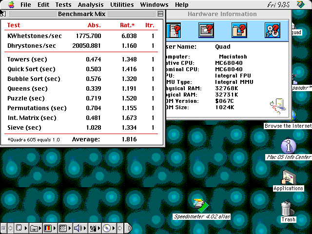
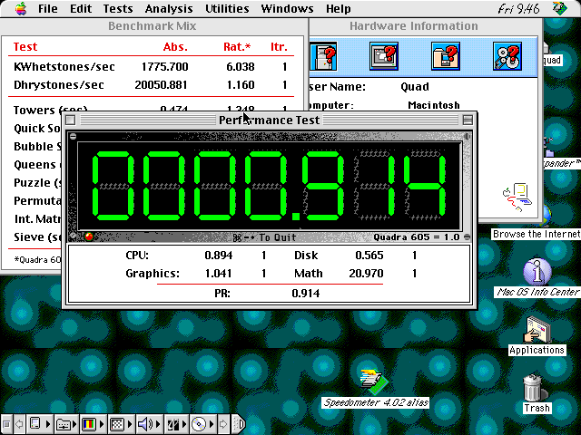
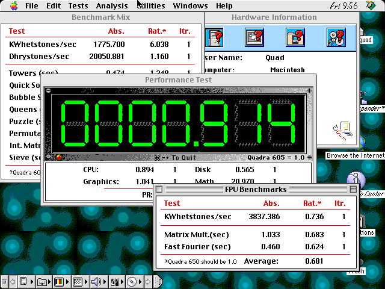

# September 25 fresh Speedometer comparison

The full-feature MiSTer core scored **1.816** in a fresh Speedometer 4.02
Benchmark Mix run at 33 MHz. The real Quadra 800 photograph scores **1.897**:
this fresh result is **95.7%** of the reference aggregate (4.3% lower).
The earlier five valid runs on the same artifact had median **1.828**
(range 1.817–1.829, 96.4% of the photographed reference).

[Clean MiSTer screenshot](interim_wqmlab_20260925/fresh_mix_clean.png) ·
[Real Quadra 800 photograph](real_quadra800.jpg) ·
[Completion alert](interim_wqmlab_20260925/fresh_mix_complete.png) ·
[All-ten setup](interim_wqmlab_20260925/fresh_mix_setup.png)

## Metric comparison

Rates and Mix are higher-is-better; elapsed seconds are lower-is-better.
The last column expresses relative speed: MiSTer/real for rates and Mix,
real/MiSTer for elapsed times. Values above 100% favor MiSTer.

| Metric | Fresh MiSTer | Real Quadra 800 | Relative speed |
|---|---:|---:|---:|
| KWhetstones/s | 1775.700 | 1978.474 | 89.8% |
| Dhrystones/s | 20050.881 | 24999.350 | 80.2% |
| Towers (s) | 0.474 | 0.469 | 98.9% |
| Quick Sort (s) | 0.503 | 0.532 | 105.8% |
| Bubble Sort (s) | 0.576 | 0.566 | 98.3% |
| Queens (s) | 0.339 | 0.307 | 90.6% |
| Puzzle (s) | 0.719 | 0.799 | 111.1% |
| Permutations (s) | 0.704 | 0.619 | 87.9% |
| Int. Matrix (s) | 0.481 | 0.599 | 124.5% |
| Sieve (s) | 1.028 | 0.974 | 94.7% |
| Mix score | 1.816 | 1.897 | 95.7% |

MiSTer is ahead on Quick Sort, Puzzle, and Int. Matrix in this run. The largest
remaining deficits are Dhrystones and Permutations. Aggregate proximity does
not mean every workload has reached real-hardware parity.

## Conditions and limits

The fresh run started at 09:32:40 UTC; the done-alert capture is timestamped
09:34:38 UTC, and the unobstructed table 09:35:02 UTC. These are acquisition
bounds, not a measured benchmark duration. All ten tests were selected with
one iteration. Root independently reviewed the setup, completed alert, and
clean table; Matrix and Sieve are nonzero and plausible. This is one additional
run, not a replacement five-run median.

Artifact SHA-256:
`4687167a16beb4077b970bf1cb46f0ba08a2fac724d2367f5d91e1390045da6c`,
source `15a1449`, normal-feature seed-21 configuration. The restored current
build inputs match its archived input manifest. Ethernet and CD-ROM/audio are
compiled in, as is the hard-disk block cache. Slot 0 was the disposable
`QuadSquad8-pipeline-test-20260919.hda`; the protected original was not used.

The guest has 32 MiB RAM; the real reference shows 122,880 KiB (120 MiB).
Both display an MC68040, integral FPU/MMU, ROM version $067C, and 1024 KiB ROM.
The photograph is one reference observation, not a controlled paired trial.
It also includes color benchmarks, which this Mix run does not reproduce;
the separate new reference below supplies disk and FPU results.

CPU/RAM/HDMI setup misses remain -2.406/-0.697/-0.426 ns. This is a fitted,
hardware-tested interim artifact, not a timing-clean release. Physical audible
output and OSD verification remain deferred at the user's request; A/UX is
left to Dani because its disk is unavailable.

## Disk benchmark

Speedometer's top **Tests → Performance Rating** item completed with its
**CPU, Graphics, Disk, and Math categories all enabled, one iteration each**.
The drive chooser selected **Quad Squad**, the disposable HDA, and explicitly
required **1 MB free for its temporary file**. No cache settings were changed;
the compiled 32-sector disk block cache remained enabled. No separate cold-cache
or absolute bandwidth measurement was performed.

| Performance Rating category | MiSTer | Real Quadra 800 | Relative rating |
|---|---:|---:|---:|
| CPU | 0.894 | 1.186 | 75.4% |
| Graphics | 1.041 | 1.347 | 77.3% |
| **Disk** | **0.565** | **3.443** | **16.4%** |
| Math | 20.970 | 20.011 | 104.8% |
| Overall PR | 0.914 | 1.605 | 56.9% |

The panel states **Quadra 605 = 1.0**. These are relative ratings, **not MB/s**.
The CPU category here is a different workload from Benchmark Mix and must not
be substituted for the Mix score of 1.816. Both category panels show one iteration.

The [new real Quadra photograph](speedometerrealquadra.png), supplied September 25,
shows Disk **3.443**: MiSTer reaches **16.4%** of that rating (the real machine
rates about **6.09 times** higher). This supports prioritizing disk profiling,
but is not a controlled throughput comparison: the real disk hardware, volume,
and cache conditions are unknown. Math here is a different test from the
separate FPU Benchmarks panel and cannot stand in for those results.

The new photograph also shows a second CPU Mix observation, **1.899**, close
to the original **1.897**. The detailed CPU table above deliberately retains
the original reference rather than combining metrics from different runs.

The suite was started at 09:43:27 UTC, the disk-volume choice was confirmed at
09:45:12 UTC, the completed alert captured at 09:46:40 UTC, and the clean panel
at 09:46:47 UTC. The interactive drive-selection delay is not benchmark runtime.
Root independently reviewed the selected volume, settings, completed alert, and
clean ratings. This is one initial disk benchmark, not a complete disk profile.

[Suite settings](interim_wqmlab_20260925/performance_rating_setup.png) ·
[1 MB drive chooser](interim_wqmlab_20260925/disk_volume_chooser.png) ·
[Completed alert](interim_wqmlab_20260925/performance_rating_complete.png)

The guest is left running Speedometer with this clean Performance Test panel
visible at that checkpoint. The later FPU panel is now foremost. The original
CD selection remains restored.

## Separate FPU comparison

The new photograph uses **Quadra 650 = 1.0** for FPU Benchmarks, unlike the
Performance Rating panel’s Quadra 605 baseline. Its absolute results are
**5456.609 KWhetstones/s**, **0.713 s Matrix Multiply**, and **0.288 s Fast
Fourier**, with average rating **1.011**. The matching MiSTer run completed with all three tests
selected at one iteration and average **0.681**, or **67.4%** of the reference.

| FPU metric | MiSTer | Real Quadra 800 | Relative speed |
|---|---:|---:|---:|
| KWhetstones/s | 3837.386 | 5456.609 | 70.3% |
| Matrix Multiply (s) | 1.033 | 0.713 | 69.0% |
| Fast Fourier (s) | 0.460 | 0.288 | 62.6% |
| Average rating | 0.681 | 1.011 | 67.4% |

MiSTer's individual displayed ratings are 0.736, 0.683, and 0.624;
the real machine shows 1.047, 0.990, and 0.996. The rate/time ratios above use
the absolute values, with elapsed-time ratios inverted as in the CPU table.
This establishes a substantial FPU workload gap despite the closer CPU Mix;
Performance Rating Math (20.970 versus 20.011) does not contradict it because
that is a different workload.

Setup was captured at 09:54:32 UTC, started at 09:54:51 UTC, completion alert
at 09:55:49 UTC, and clean result at 09:56:11 UTC. These are acquisition bounds,
not instrumented benchmark runtime. Root independently reviewed the clean
result table. This is one run on the same artifact and disposable disk.

[Setup](interim_wqmlab_20260925/fpu_setup.png) ·
[Completion](interim_wqmlab_20260925/fpu_complete.png) ·
[Real reference](speedometerrealquadra.png)

The guest remains running with the FPU results foremost; no shutdown or core
replacement followed this capture.
